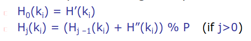
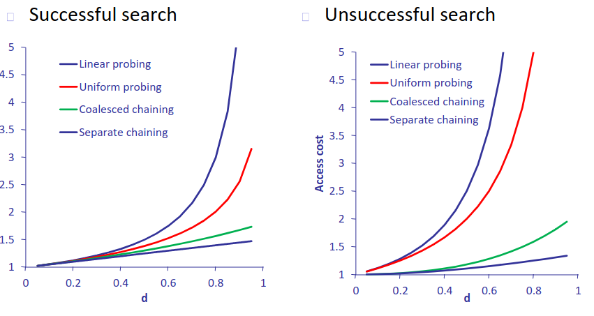

- ### LOAD FACTOR
	- data una stima dei record N una capacita C si determina il load factor d
	- #### imposizioni
		- necessario che un bucket sia caricabile con una sola operazione di IO
		- il costo del trasferimento di un bucket di capacità C deve costare meno del trasferimento di due bucket di capacita minore di C
	- #### GESTIRE OVERFLOW
		- ##### STRATEGIE
			- ###### chaining
				- liste separate
					- tutti i record sono linkati in una lista
					- 
				- concatenamento convergente
					- si usa un solo puntatore per bucket
					- i bucket sono collegati a lista
					- prestazioni peggiori ma ottimizzazione della memoria
					- {:height 241, :width 253}
			- ###### open addressing
				- non vengono usati puntatori
				- a una chiave viene associata una lista di indirizzi
				- quando si inserisce un valore di chiave si testano tutti gli indirizzi finchè non si trova l'indirizzo di un bucket non pieno
			- ###### linear probing
				- a ogni step l'indirizzo viene aumentato di un valore costante
				- 
				- ###### primary clustering
					- se un bucket va in overflow anche il bucket+P è probabile che vada in overflow
			- ###### quadratic probing
				- a ogni step l'indirizzo viene aumentato di un valore lineare
				- resta comunque il problema delle chiavi
			- ###### double hashing
				- vengono utilizzate due funzioni hash
				- 
		- #### COSTI
			- 
- ### PROBLEMATICHE DELLA ORGANIZZAZIONE STATICA
	- è complesso stimare il dimensionamento degli indici hash
		- se si sovrastima la dimensione dell'area primaria si ha un pessimo utilizzo della memoria
		- se si sottostima si hanno pessime performance dovute hai continui accessi all'area di overflow
- ### HASH DINAMICO
	- la dimensione dell'area primaria è calcolata dinamicamente
	- se un bucket va in overflow l'area primaria viene ampliata
		- viene raddoppiato il codominio della funzione hash
		- non necessariamente raddoppia l'area primaria
		- necessario specificare quali bucket sono utilizzati
	- se vengono eliminati dei record l'area primaria viene ridotta
	- ### tipologie
		- #### con directory
		- #### senza directory
			- ##### linear hashing
	-
	-
	-
	-
	-