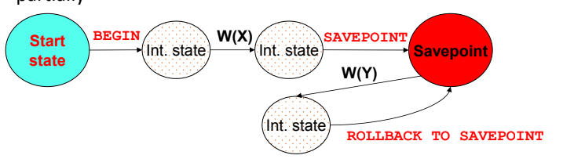
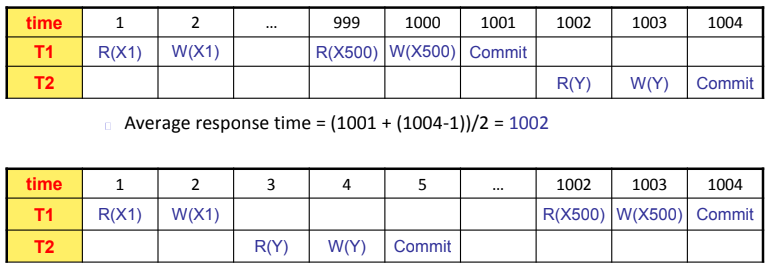
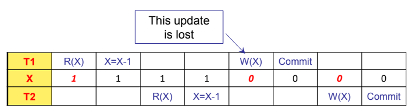
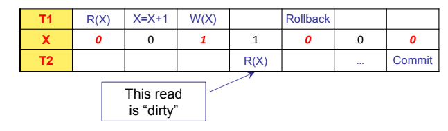
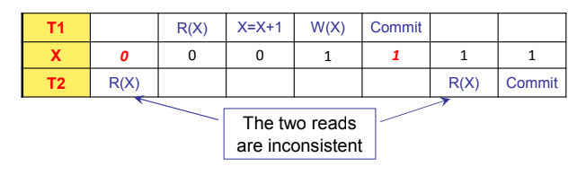
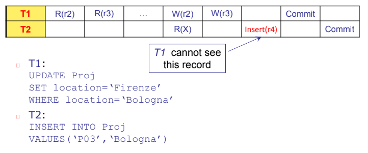

- [[TRANSAZIONI]]
	- sequenza di operazioni che portano il db da uno stato iniziale consistente a uno stato finale consistente
	- gli stati intermedi **non sono perforza consistenti**
	- **COMMIT**
		- quando la transazione termina correttamente
	- **ROLLBACK**
	  id:: 642402f0-f791-4e84-a3d3-f55dacbe9ad5
		- quando la transazione fallisce
		- tutte le modifiche apportate devono essere annullate
		- le modifiche già salvate su disco devono essere annullate
	- possibile stabilire dei *punti di salvataggio* detti **SAVEPOINT**
		- la transazione in caso di ((642402f0-f791-4e84-a3d3-f55dacbe9ad5)) viene riportata all'ultimo savepoint
		- 
	- #### CONCORRENZA
		- ##### ESECUZIONE SERIALE
			- solo una transazione può essere eseguita alla volta
			- scarsa efficienza delle transazioni
		- ##### ESECUZIONE INTERLEAVED
			- le transazioni vengono eseguite in maniera concorrente
			- maggiore efficienza
			- problematica del garantire l'isolamento
			- 
			- #### PROBLEMATICHE DOVUTE ALLA CONCORRENZA
				- ##### LOST UPDATE
					- due transazioni eseguono una modifica allo stesso dato, aggiornamento inconsistente
					- 
				- ##### DIRTY READ
					- una transazione ha letto dati modificati da un altra transazione non ancora terminata
					- 
				- ##### UREPEATABLE READ
					- una transazione legge dati che vengono successivamente modificati da un altra transazione
					- 
				- ##### PHANTOM ROW
					- una transazione aggiunge dati consistenti con i risultati di ricerca di un'altra transazione che ha già eseguito la lettura dei dati e non è a conoscenza della modifica
					- 
				-
				-