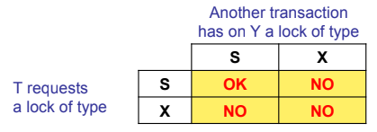
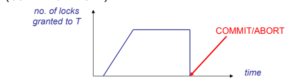
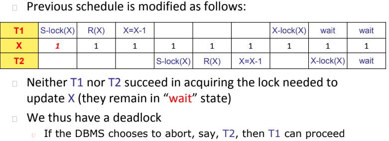
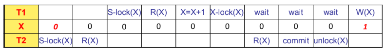
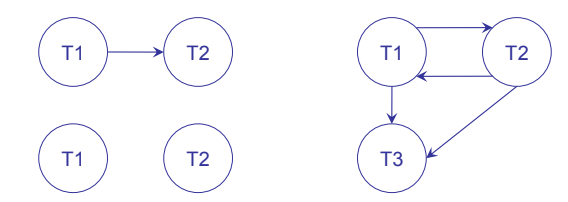
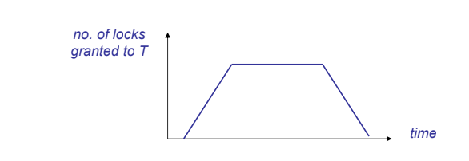
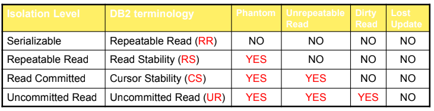

- [[TRANSAZIONI]]
	- sequenza di operazioni che portano il db da uno stato iniziale consistente a uno stato finale consistente
	- gli stati intermedi **non sono perforza consistenti**
	- **COMMIT**
		- quando la transazione termina correttamente
	- **ROLLBACK**
	  id:: 642402f0-f791-4e84-a3d3-f55dacbe9ad5
		- quando la transazione fallisce
		- tutte le modifiche apportate devono essere annullate
		- le modifiche già salvate su disco devono essere annullate
	- possibile stabilire dei *punti di salvataggio* detti **SAVEPOINT**
		- la transazione in caso di ((642402f0-f791-4e84-a3d3-f55dacbe9ad5)) viene riportata all'ultimo savepoint
		- 
	- #### CONCORRENZA
		- ##### ESECUZIONE SERIALE
			- solo una transazione può essere eseguita alla volta
			- scarsa efficienza delle transazioni
		- ##### ESECUZIONE INTERLEAVED
			- le transazioni vengono eseguite in maniera concorrente
			- maggiore efficienza
			- problematica del garantire l'isolamento
			- 
			- #### PROBLEMATICHE DOVUTE ALLA CONCORRENZA
				- ##### LOST UPDATE
				  id:: 642406aa-f889-441c-81e4-c21a5100bd63
					- due transazioni eseguono una modifica allo stesso dato, aggiornamento inconsistente
					- 
				- ##### DIRTY READ
				  id:: 642406bd-c2c6-4668-9af0-f396ed467565
					- una transazione ha letto dati modificati da un altra transazione non ancora terminata
					- 
				- ##### UREPEATABLE READ
					- una transazione legge dati che vengono successivamente modificati da un altra transazione
					- 
				- ##### PHANTOM ROW
					- una transazione aggiunge dati consistenti con i risultati di ricerca di un'altra transazione che ha già eseguito la lettura dei dati e non è a conoscenza della modifica
					- 
			- #### PROPRIETA DELLO SCHEDULE
				- ##### SERIALE
				  id:: 642409d3-572e-4dab-9e0c-1e7467147835
					- schedule che esegue transazioni in maniera seriale
				- ##### SERIALIZZABILE
					- le transazioni terminate correttamente hanno lo stesso effetto che avrebbero in uno schedule seriale
				- ##### RECUPERABILE
					- se una transazione T1 legge un valore modificato da un altra transazione T2 T1 termina solo dopo la T2
					- possibile salvare il db da ((642406bd-c2c6-4668-9af0-f396ed467565))
				- ##### CASCADELESS
					- una transazione puo leggere solo valori che sono modificati da transazioni terminate correttamente
				- ##### STRICT
				  id:: 64240b30-c0cc-4333-936e-52a04da4e225
					- una transazione non scrive o legge valori modificati da un'altra transazione attiva
			- ### METODI PER GARANTIRE L'ISOLAMENTO
				- si sfruttano i **LOCK**
				- la richiesta del lock è implicita e invisibile al livello SQL
				- importante definire anche la granularità del lock
				- #### TIPOLOGIE DI LOCK
					- ##### SHARED
					  id:: 64240e13-e687-4f8c-98c7-b878ee58f81f
						- lock richiesto per leggere
					- ##### EXCLUSIVE
					  id:: 64240e1d-7252-402a-9f84-79de633108fd
						- lock richiesto per scrivere
				- #### COMPATILBILITÀ TRA LOCK
				  id:: 64240e3c-8a07-4165-9367-21ea73ad7334
					- 
					- possono essere presenti piu lock solo se tutti shared
				- il lock manager si occupa di gestire i lock sulle risorse del sistema
					- necessario definire un **PROTOCOLLO DI ACQUISIZIONE** del lock
					- #### PROTOCOLLI
						- ##### STRICT 2 PHASE LOCK
							- la transazione acquisisce quando sono necessari i lock richiesti ma non li rilascia fino alla terminazione
							- 
							- possibili situazioni di **deadlock** in quel caso il sistema abortisce una delle due transazioni
							- non è necessario rilasciare i lock come operazioni atomiche al termine della transazione
							- in grado di evitare ((642406aa-f889-441c-81e4-c21a5100bd63))
								- 
							- in grado di evitare ((642406bd-c2c6-4668-9af0-f396ed467565))
								- 
							- gli schedule generati da questo protocollo insieme alla ((64240e3c-8a07-4165-9367-21ea73ad7334)) sono di tipo ((64240b30-c0cc-4333-936e-52a04da4e225))
						- ##### GRAFO DI SERIALIZZABILITÀ
							- un nodo per ogni transazione terminata correttamente
							- un arco fra due transazioni quando una ha eseguito precedentemente una azione che interferisce con un altra transazione
							- 
							- **CONFLICT EQUIVALENT**
								- gli schedule coinvolgono le stesse transazioni
								- l'ordinamento delle operazioni in conflitto è uguale
							- **CONFLICT SERIALIZABLE**
							  id:: 642413e0-633a-4a27-9078-47492ae79121
								- lo schedule è equivalente a uno schedule ((642409d3-572e-4dab-9e0c-1e7467147835))
								- il grafo di serializzabilità non presenta cicli
							- il protocollo genera solo schedule ((642413e0-633a-4a27-9078-47492ae79121))
						- ##### 2 PHASE LOCK
							- una transizione non può acquisire altri lock quando ne rilascia anche uno solo di questi
							- 
							- il protocollo genera solo schedule ((642413e0-633a-4a27-9078-47492ae79121)) ma a differenza della versione strick gli schedule non sono ((64240b30-c0cc-4333-936e-52a04da4e225))
						- #### RISOLVERE PHANTOM ROW
							- lock nella foglia all'interno dell'indice
							- si esegue il lock sul'indice di tutti i record che soddisfano un dato predicato
					- #### LOCK MANAGER
						- tabella delle transazioni attive
						- tabella dei lock che descrive per ogni oggetto i lock a lui associati
						- alla richiesta di un lock il lock manager esplora la struttura
							- se viene richiesto un lock ((64240e13-e687-4f8c-98c7-b878ee58f81f)) e sono presenti solo lock ((64240e13-e687-4f8c-98c7-b878ee58f81f)) allora viene garantito il lock
							- se viene richiesto un lock ((64240e1d-7252-402a-9f84-79de633108fd)) viene concesso solo se non è presente un altro lock
					- #### GESTIONE DEI DEADLOCK
						- ##### STRATEGIE DI PREVENZIONE
							- viene assegnata una priorità alle transazioni
							- date T1 e T2 con T2 che detiene un lock richiesto da T1
								- **WAIT-DIE**
								  id:: 6424211c-100f-4827-bbd2-3f10b3c84b48
									- se T1 ha priorita maggiore allora viene lasciata in attesa, atrimenti viene uccisa
								- **WOUND-WAIT**
									- se T1 ha priorita maggiore  T2 viene abortita, altrimenti T1 aspetta
									  id:: 642420ac-d677-418a-94b4-fe91e687e566
								- preferibile ((6424211c-100f-4827-bbd2-3f10b3c84b48))
						- ##### STRATEGIE DI RILEVAMENTO
							- **TIMEOUT**
								- se la transazione aspetta troppo viene abortita
								- si rischia di abortire transazioni non in deadlock
								-
						- ##### PROTOCOLLO CONSERVATIVE 2 PHASE LOCK
							- una transazione prima di iniziare richiede tutti i lock di cui a bisogno
							- maggior numero di lock
							- lock detenuti per piu tempo
							- transazioni generalmente piu veloci
			- #### CONTROLLO DELLA CONCORRENZA IN SQL
				- le richieste di lock sono implicite
				- possibile richiedere a livello SQL un **LIVELLO DI ISOLAMENTO**
				- 
	- #### SISTEMI ALTERNATIVI
		- ##### optimistic concurrency control
			- al termine viene controllato se ci sono stati conflitti e in quel caso viene abortita la transazione
		- ##### timestamp concurrency control
	- #### CONTROLLO DELLA ((6421c858-9048-4a02-bc33-e399ec6df6da))
		- **ALGORITMO ARIES**
		  id:: 64253771-8c0f-4536-ab73-6b7a83a12a76
			- sviluppato in IBM è una famiglia di algoritmi per il logging e il recovery management
			- ##### tipologie di fallimento
				- transaction failure
				- system failure
				- device failure
			- ##### assunzione base
				- la scrittura di una pagina su disco è atomica
			- #### BUFFER MANAGEMENT
				- ##### NO STEAL
					- le pagine vengono scritte solo dopo che una transazione è terminata
				- ##### STEAL
				  id:: 64253771-98fd-43c9-b060-850b3aa2a2e2
					- le pagine vengono scritte quando è più opportuno
			- #### COMMIT DI UNA TRANSAZIONE
				- ##### FORCE
					- la formalizzazione di una transazione è dettata dal buffer manager che la determina nel momento in cui tutte le pagine sono scritte
				- ##### NO FORCE
				  id:: 64253771-9d80-4832-a862-101b77d14c2a
					- la formalizzazione della terminazione di una transazione non attende la scrittura delle pagine
			- #### STRUMENTI PER IL RECOVERY
				- backup **FONDAMENTALE MANCO A DIRLO**
				- file di log dove vengono memorizzati tutte le operazioni di update eseguite dalle transazioni
				-
		-
		-
		-