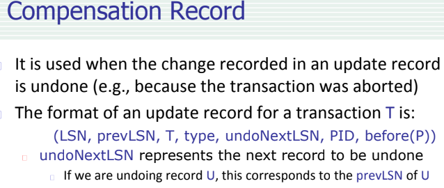
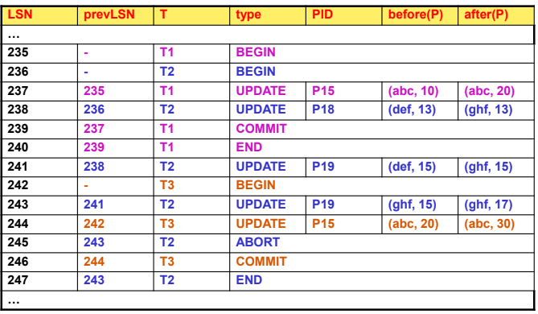

- ## LOG
	- raccoglie informazioni riguardanti le operazioni eseguite dalle transazioni
		- **BEGIN**
			- inizio di una transazione
		- **UPDATE**
		  id:: 64256287-302a-4e31-a5fa-bc9df04c4372
			- aggiornamento del record
		- **COMMIT**
			- successo di una transazione
		- **ABORT**
			- fallimento di una transazione
		- **END**
			- terminazione di una transazione
		- **COMPENSATION**
		  id:: 64256290-965f-4641-9598-a1943e3524bd
			- recupero dello stato di una pagina gia scritta su disco da parte di una transazione fallita
			-
	- #### FORMATO
		- ((64256287-302a-4e31-a5fa-bc9df04c4372))
			- 
		- ((64256290-965f-4641-9598-a1943e3524bd))
			- 
		- per ogni record di update viene creato un record di compensation
	- 
	-
-