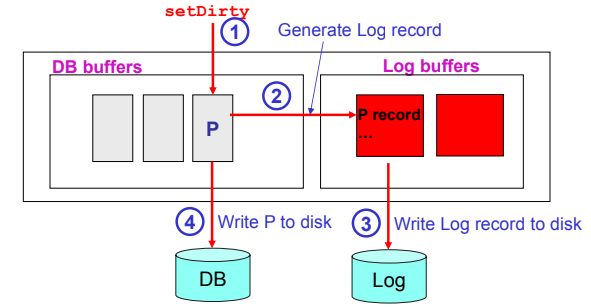

- ## LOG
	- raccoglie informazioni riguardanti le operazioni eseguite dalle transazioni
	- i record sono **collegati a lista**
		- **BEGIN**
			- inizio di una transazione
		- **UPDATE**
		  id:: 64256287-302a-4e31-a5fa-bc9df04c4372
			- aggiornamento del record
		- **COMMIT**
		  id:: 64256289-f34d-478d-8516-8fdd3f171e74
			- successo di una transazione
		- **ABORT**
		  id:: 6425628e-f678-4ff7-8b1f-48d0948ac33d
			- fallimento di una transazione
		- **END**
			- terminazione di una transazione successiva a ((64256289-f34d-478d-8516-8fdd3f171e74)) e ((6425628e-f678-4ff7-8b1f-48d0948ac33d))
		- **COMPENSATION**
		  id:: 64256290-965f-4641-9598-a1943e3524bd
			- recupero dello stato di una pagina gia scritta su disco da parte di una transazione fallita
			-
	- #### FORMATO
		- ((64256287-302a-4e31-a5fa-bc9df04c4372))
			- 
		- ((64256290-965f-4641-9598-a1943e3524bd))
			- 
		- per ogni record di update viene creato un record di compensation
	- 
	- il dbms per ogni operazione deve scrivere sul log **PRIMA**
	- possibili scritture sul log di operazioni non eseguite
	- possibili ripristini non necessari
	- a implementare il write-ahead logging è il ((6421c859-e576-4cb6-ab0f-7036468a8c2e))
	- 
	- il log deve essere scritto su **STORAGE STABILE**
	- una transazione è terminata correttamente quando il suo record di log ((64256289-f34d-478d-8516-8fdd3f171e74))
	- #### FALLIMENTO DI UNA TRANSAZIONE
		- si risale la lista dei record di log fino al begin della transazione e ne se riprestina lo stato
		- 
	- #### FALLIMENTO DI SISTEMA
	  id:: 642567be-2aba-49d1-8718-d3eb7b9f59b5
		- tutte le transazioni che non hanno scritto nel log il record di ((64256289-f34d-478d-8516-8fdd3f171e74)) vanno hannullate
		- se si adotta la politica ((64253771-9d80-4832-a862-101b77d14c2a)) alcune modifiche di transazioni potrebbero non essere state scritte su disco allora la transazione va rieseguita
	- #### CHECKPOINTS
		- record di log che contiene la tabella delle transazioni attive
		- utile per evitare di scorrere tutto il log in caso di ((642567be-2aba-49d1-8718-d3eb7b9f59b5))
		- tutte le pagine modificate vengono scritte su disco
	- ((64253771-8c0f-4536-ab73-6b7a83a12a76))
		- #### ANALISI
			- determina le pagine attive al momento del crash
			- si risale il log fino al checkpoint piu recente
			- si riprestina la tabella delle transizioni allo stato del checkpoint s
			- si rianalizza il log in avanti
			- se una transazione ha scritto i record di abort o commit viene rimossa dalla tabella delle transazioni attive
			- tutte le pagine che subiscono i record di update o compensation vengono caricate in memoria come pagine sporche
			-
		- #### REDO
			- riesegue tutti i record di update **anche quelli delle transazioni che poi vengono annullate**
			- accertamento delle scritture delle transazioni su disco
			-
		- #### UNDO
			- tutte le transazioni non terminate o non terminate correttamente vengono annullate
		- #### principi base
			- wal protocol
			- si riesegue lo storico in fase di redo
			- fare log mentre si esegue l'undo
				- evita inutili operazioni di undo
	- #### FALLIMENTO DEL DISCO
		- viene ripristinato un backup del database (dump)
		- **PERCHE ARIES**
			- per compensare alle politiche ((64253771-98fd-43c9-b060-850b3aa2a2e2)) e ((64253771-9d80-4832-a862-101b77d14c2a))
			- siccome le corrispettive varianti sono meno performanti si sfrutta aries per compensare alle mancanze di ((64253771-98fd-43c9-b060-850b3aa2a2e2)) e ((64253771-9d80-4832-a862-101b77d14c2a))
	- m
-