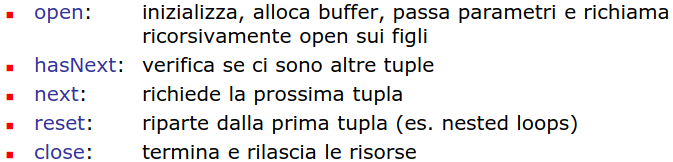

- # OTTIMIZZAZIONE DELLE QUERY
	- ## CATALOGHI DI SISTEMA
		- tabelle in un loro spazio dei nomi **contengono i metadati** sul DB
		- schemi rilevanti
			- ##### SYSCAT
				- DB2 realizza lo standard  tramite le viste contenute in questo schema
			- ##### SYSSTAT
				- tabelle che contengono informazioni sul sistema
	- ## RAPPRESENTAZIONE INTERNA DI UNA QUERY
		- la query viene rappresentata internamente come un albero
		- 
		- ### REWRITING
			- prima di qualunque cosa la query viene riscritta (*ottimizzazione semantica*)
			- lo scopo è quello di semplificare la query
			- le operazioni svolte sono
				- #### RISOLUZIONE DELLE VISTE
					- eliminazione delle liste
					- ##### esempio
						- s
				- #### UNNESTING
					- si cerca di rimuovere le subquery
					- ##### esempio senza correlazione
						- 
					- ##### esempio con correlazione
						- 
				- #### USO DEI VINCOLI
					- si sfruttano i vincoli sui dati per semplificare la query
					- ##### esempio
						- 
						- 
		- ### OTTIMIZZAZIONE
			- la fase che partendo dalla query riscritta genera un ((643ff00e-c706-4785-b008-330d570e6ece)) ovvero un albero di ((643ff00e-6492-49d1-b46b-a360d995014f))
			- 
			- ### ESECUZIONE DEL PIANO DI ACCESSO
				- due possibilità di esecuzione
				- #### PER MATERIALIZZAZIONE
					- ogni operatore genera il risultato in una tabella temporanea
					- non parallelizzabile
					- le tabelle generate possono richiedere operazioni di IO
					- ##### esempio
						- 
						- 
				- #### IN PIPELINE
					- gli operatori sono inseriti in una sorta di pipeline
					- ogni operatore richiede i dati agli operatori in input
					- piu efficiente
					- non sempre possibile (*operatore sort*)
					- ##### esempio
						- 
				- #### INTERFACCIA ITERATORE
					- per semplificare il codice di ordinamento si usa un interfaccia standardizzata per gli operatori
					- 
					-
					-
				-