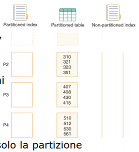

- # PROGETTO FISICO E TUNING DB
	- non esiste algoritmo risolutivo
	- ## PROBLEMATICHE PRINCIPALI
		- #### Selezione degli indici
			- Su quali attributi conviene costruire un indice?
			- Un indice può velocizzare alcune query, ma tipicamente rallenta le transazioni
		- #### Data clustering
			- Conviene mantenere i dati ordinati? Su quale attributo?
		- #### Data partitioning
			- Conviene partizionare i dati?
			- Fondamentale in ambito distribuito, ma importante anche in DBMS centralizzati
		- #### Modifiche dello schema logico per migliorare le prestazioni
			- Denormalizzazione, replicazione
		- #### Riscrittura di query/transazioni
			- SQL server-side (trigger, stored procedures)
	- ## WORKLOAD
		- fondamentale sapere l'utilizzo dei dati
			- Un **elenco di query con la rispettiva frequenza di esecuzione**
			- Un **elenco di transazioni** (operazioni di modifica) con la rispettiva **frequenza di esecuzione**
			- Un **obiettivo di prestazioni** per ciascun tipo di query/operazione di modifica
		- il workload puo essere monitorato a tempi di esecuzione
		- ### DB2 WORKLOAD MANAGER
			- strumento che permette di monitorare query e transazioni
	- il tuning del db risulta **sempre necessario**
		- fondamentale ricordare che **le scelte di design/tuning devono essere coerenti con quanto il DBMS farà a run-time**
	- ## SELEZIONE DEGLI INDICI
		- può essere modellato con un **problema di ottimizzazione**
		- spazio delle possibili soluzioni è enorme
		- si considerano prima gli indici che possono migliorare le **query più importanti** poi si considerano indici più marginali
	- ## DESIGN ADVISOR
		- sistema per suggerire possibili piani di ottimizzazione
	- ## LINEE GUIDA
		- #### Creazione di un indice
			- Non creare indici inutili
			- Creare prima indici che velocizzino più di una query
			- Considerare l'impatto dei costi di modifica, quindi attenzione a creare
			  indici su attributi soggetti spesso ad aggiornamenti!
		- #### Scelta degli attributi da indicizzare
		  id:: 645245f1-4b50-468b-bbcb-a8969b80076d
			- Quelli presenti nelle clausole WHERE, GROUP BY, ORDER BY
		- #### Uso di indici composti
		- Valutare la possibilità di permettere piani index-only
		- Attenzione all'ordine degli attributi in caso di predicati di range
		- Vedi ((6437e3ed-a9f4-4c47-8307-de5c5449a0bd))  e ((6437e3fa-9079-4c4f-8721-cdadd3db9312))
	- ## DATA CLUSTERING
		- Le query di range sono quelle che beneficiano maggiormente dalla clusterizzazione di un indice
		- Anche le ricerche '=' su attributi non chiave traggono vantaggio da indici clustered in caso di molti duplicati
		- I piani di accesso index-only non necessitano di indici clustered
	- ## COLLEZIONE DI STATISTICHE SU DB2
		- vanno raccolte tabella per tabella
		- Le informazioni statistiche su tabelle e indici sono fondamentali per permettere all'ottimizzatore di operare scelte accurate e per poter ragionare in fase di tuning
		- In DB2 si usa il **comando RUNSTATS**
		- Esistono molte varianti, tra cui:
		- ```
		  RUNSTATS ON TABLE MySchema.TableName 
		  WITH DISTRIBUTION ON ALL COLUMNS 
		  AND DETAILED INDEXES ALL
		  ```
		- La forma WITH DISTRIBUTION indica di collezionare statistiche dettagliate sulle distribuzioni dei valori (istogrammi e valori frequenti) delle varie colonne (ON ALL COLUMNS)
		- La forma DETAILED INDEXES ALL genera informazioni utili per capire lo "stato di salute" di un indice e il costo di un index scan
	- ## PARTIZIONAMENTO DEI DATI
		- scopo di migliorare le prestazioni
		- ### TIPOLOGIE
			- #### PARTIZIONAMENTO VERTICALE
				- E' il caso in cui gli attributi di una relazione vengono ripartiti su 2 o più table, mantenendo su ognuna la primary key
			- #### PARTIZIONAMENTO ORIZZONTALE
				- In una relazione partizionata orizzontalmente sono le tuple che vengono fisicamente ripartite in 2 o più table
				- La relazione originale si ottiene facendo la UNION delle diverse table
				- Permette di superare i limiti sulla dimensione massima di una relazione
				- ### POSSIBILI STRATEGIE
					- #### Hash partitioning
						- obbiettivo ottenere una distribuzione uniforme nelle partizioni
						- si sfrutta una funzione hash su una chiave
					- #### Range partitioning
						- si partiziona in base a intervalli di valori di un particolare attributo
						- scopo mettere insieme tuple con lo stesso valore di attributo
		- ### PARTIZIONAMENTO DEGLI INDICI
			- in caso di table partizionate si puo partizionare anche gli indici
			- se l'indice è dichiarato UNIQUE, allora la chiave dell'indice **deve includere la partitioning key** per poter essere partizionato(*vincolo di DB2*)
				- questo per evitare di scansionare tutte le partizioni degli indici in fase di inserimento di record
				- 
				-