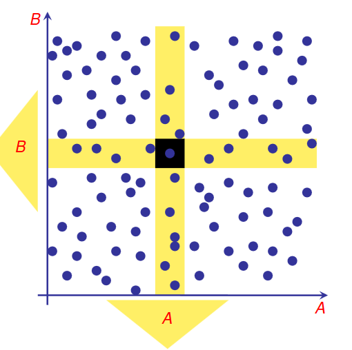
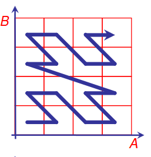

- # INDICI N-DIMENSIONALI
	- ### database n-relazionali
		- le tuple hanno **n attributi numerici**
		- ### WINDOW QUERY
			- query costruite con range su piu attributi
			- difficilmente risolvibili con query su piu attributi
	- ### PRESTAZIONI B+TREE
		- il b+tree non risulta adatto per simili ricerche
		- 
	- ### CLASSIFICAZIONI
		- #### PER OGGETTI
		- oggetti a punti (immagini)
		- oggetti a regioni (elementi di una mappa)
		- #### PER TIPOLOGIA DI SUDDIVISIONE
		- a intervalli dello spazio
		- per oggetti
	- ## CONCETTO FONDAMENTALE
		- preservare ordine locale
		- raggruppare gli oggetti vicini in maniera che vengano scritte sulle stesse pagine
		- per preservare l'ordine locale linearizzare non è una buona idea
		- 
		-
		-
		-