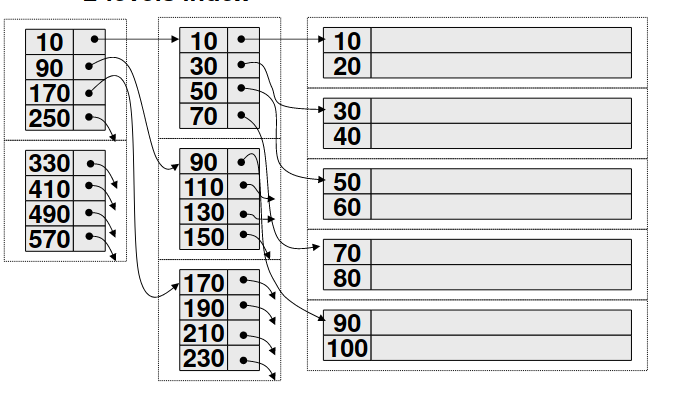

- TODO completare con parte iniziale
- b+tree come indice secondario
	- l'indice è organizzato come coppie **<valore, lista di RID>**
	- cosa succede se le liste sono lunghe?
		- pagine di overflow
			- la foglia è strutturata in piu pagine
		- duplicazione delle chiavi nell'indice
			- implicazione sull'algoritmo di ricerca
				- se la chiave è duplicata non ci si può fermare al primo valore trovato
			- inefficenza anche per le operazioni di eliminazione
		- scelta di usare i PID al posto dei RID ((64047a90-bd7d-4d86-b877-c4ef22149d50))
			- TODO aggiungere contenuto
		- posting files
			- TODO aggiungere contenutoù
	- b+tree come data file
		- problemi
			- aggiornamenti o spostamenti di un record possono essere problematici (cambiamento del RID)
	- b+tree compressione
		- i valori dei separatori dell'albero non devono essere necessariamente valori presenti nell'albero
		- possibile ridurre la dimensione dei separatori
		- non si utilizza nelle foglie perche aggiunge indirettezza (necessita di accedere al file dati per verificare la appartenenza di un record a un predicato)
	- b+tree risoluzione query
		- `SELECT * FROM persone WHERE cognome="Rossi" AND anno>1990`
		- usando indice su cognome
		- usando indice su anno
		- usando entrambi facendo un intersezione
		- la soluzione con un solo indice risulta inefficiente in quanto vengono lette molte tuple di cui molte non soddisfano il predicato
		- usando due indici necessita di caricare entrambi gli indici
	- INDICI MULTI ATTRIBUTO
		- formati da piu attributi, ordinati in ordine lessicografico
		- 
		- ricerche per cognome, cognome e range di anno sono efficienti
		- ricerche per anno solamente non sono efficienti
		- in generale dato un indice a N attributi sono ottimizzate in 2 casi
			- ricerca puntuale sul primo e a range sull'Nesimo attributo
			- ricerca puntuale sull'Nesimo attributo e range sul primo
		- necessario creare piu range multilivello ma in quel caso il numero di indici esplode a N!
			- scelta del progetto fisico in base alle statistiche sulle query
	- b+tree bulk loading
		- alla creazione dell'indice viene letta la tabella da indicizzare e ordinata
		- viene creata una lista <chiave,PID> che corrisponde al primo livello di indice
		- si ripete ricorsivamente fino ad arrivare alla radice
		- si genera un indice multilivello
		- 
	- implementazione del b+tree: [[GiST]]