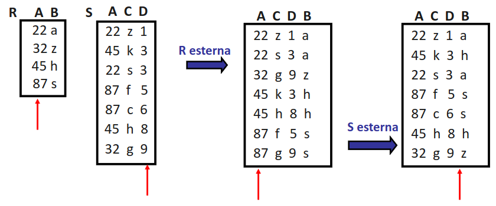
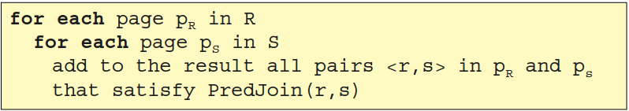
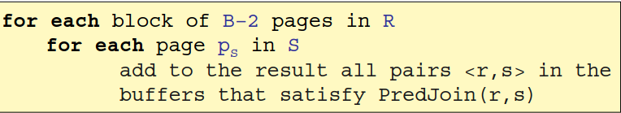
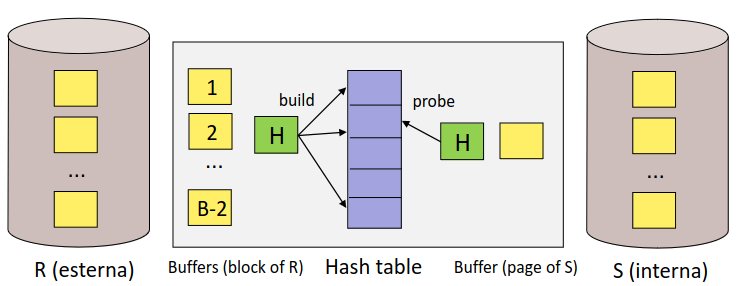
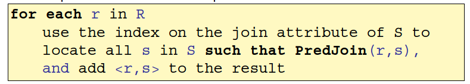
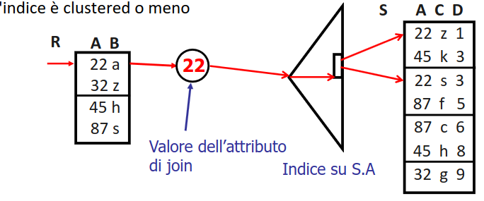
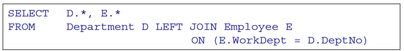
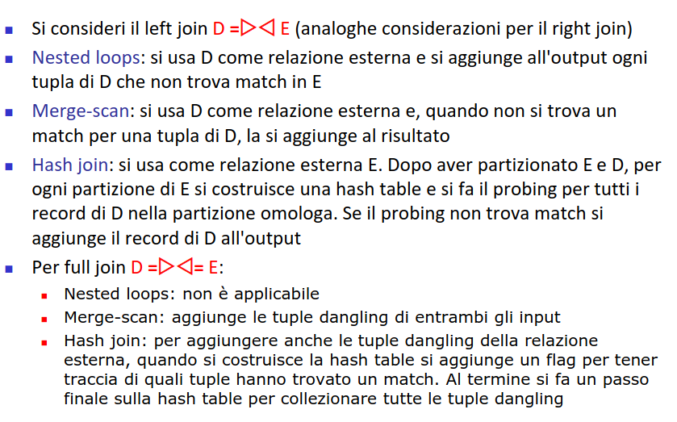

- problema in continua evoluzione
- vi è una parte tecnologica consolidata
- ## STORIA
	- ### anni 60
		- ricerche che coinvolgono chiavi primarie
	- ### anni 70
		- rivoluzione del [[B+TREE]]
	- ### anni 80
		- nuove tipologie di dati
		- nascono indici multidimensionali
		- ricerche di vicinanza e similarità
	- ### anni 90
		- sistemi eterogenei (*con dati di diversa natura*)
	- ### nuovo millennio
		- tecnologie di intelligenza artificiale utilizzate in ambito database
		- nuove architetture per big data
		- enfasi sull'analisi della qualità dei dati
		  :LOGBOOK:
		  CLOCK: [2023-04-12 Wed 11:30:51]--[2023-04-12 Wed 11:30:52] =>  00:00:01
		  :END:
- ## ALGEBRA RELAZIONALE
	- ### DIFFERENZE CON MODELLO PROPOSTO DA SQL
		- le relazioni sono insiemi (*no dati duplicati*) (*no insiemi*)
	- definita da un insieme di operatori che producono relazioni a partire da relazioni
	- ### OPERATORI
		- #### selezione
		  collapsed:: true
			- restituisce un sottoinsieme di una relazione che  soddisfa un dato predicato
		- #### proiezioni
			- restituisce un sottoinsieme degli attributi di una relazione
		- #### join
			- combina le tuple di due relaizoni in base all'uguaglianza di attributi comuni (*con lo stesso nome*)
		- #### theta-join
			- combinazione di prodotto cartesiano e selezione
		- #### unione
			-
		- #### differenza
	- ### RAPPRESENTAZIONE AD ALBERO
		- possibile rappresentare le operazioni algebriche ad albero
		- valutato in maniera bottom-up
		- 
	- ### EQUIVALENZA DI ESPRESSIONI
		- due espressioni sono equivalenti quando producono la stessa relazione
		- #### regole di equivalenza
			- ##### join associativo e commutativo
				- 
			- ##### selezione e proiezione si possono raggruppare/decomporre
				- 
			- ##### selezione e proiezione sono commutabili
				- 
				- *solo se la selezione è eseguita su Y*
			- ##### push down della selezione rispetto al join
				- 
				- push down molto importante per l'ottimizzazione
				- possibile eseguirlo anche con la proiezione
	- ### ELABORAZIONE DI QUERY MEDIANTE OPERATORI
		- operatori come mattoncini per comporre la risoluzione della query
		- necessario avere un implementazione efficiente degli operatori
		- necessario trovare la migliore combinazione degli operatori che consente di risolvere la query
		- #### OPERATORI LOGICI VS OPERATORI FISICI
			- ##### operatori logici
				- operatori relazionali
			- ##### operatori fisici
				- implementazione degli operatori logici
		- #### VIE DI ACCESSO
			- insieme di step necessari per recuperare le tuple di una relazione
				- ##### scansione sequenziale
				- ##### accesso tramite indici
		- #### PIANI DI ACCESSO
			- insieme di operazioni per accedere ai dati
			- fa uso di operatori logici
			- presenta rappresentazioni  del costo delle operazioni (*caso DB2 timeron contiene sia costi di IO che di CPU*)
			- 
			- ##### tempi di esecuzione
				- l'ottimizzatore non considera i tempi di esecuzione di una query ma il costo del suo piano d'accesso dato che i tempi di esecuzione sono influenzati da tantissimi fattori
		- #### PARAMETRI DI COSTO
			- necessario per valutare la qualità delle diverse possibilità di risoluzione necessario usare parametri che si originano dalle statistiche dei dati
			- 
	- ### OPERATORI LOGICI
		- [[SORT]]
		- [[SELEZIONE]]
		- [[PROIEZIONE]]
		- # JOIN
			- supponiamo di avere query del tipo
			- 
			- eseguire il prodotto cartesiano per poi applicare il predicato è **molto inefficente**
			- molte possibili varianti
			- ## NESTED LOOP JOIN
				- si confronta ogni record di un input con ogni  record dell'altro input
				- 
				- #### COSTO
					- `P(R) + N(R) * P(S) = P(R) + TP(R)*P(R)*P(S)`
					- è conveniente avere come relazione esterna quella con più tuple ma il guadagno sulle prestazioni non è significativo
				- ### PROPRIETÀ
					- l'algoritmo **preserva l'ordine della relazione esterna**
					- può risultare utile per altre operazioni da svolgere nella query
					- 
				- ### VERSIONE PAGINATA
					- 
					- si perde il vantaggio dell'ordinamento ma si riduce di molto il numero di I/O
				- ### SFRUTTANDO IL BUFFER
					- se si avesse un maggior numero di pagine del buffer si possono sfruttare per migliorare le prestazioni
					- si usano B-2 pagine per la relazione esterna
					- 1 per la relazione interna
					- 1 per la pagina di output
					- 
					- ci puo eseere un caso in cui la relazione interna a il maggior numero di buffer ovvero quando si **puo contentere interamente in memoria**
				- ### HASHING PER EFFETTUARE MATCHING
				  id:: 643fc349-19b4-425a-83d5-ff561d5f78f2
					- si può usare una funzione hash su i record della relazione esterna e  su quella esterna
					- 
				- ### INDEX NESTED LOOP JOIN
					- è possibile sfruttare un indice per ridurre il costo delle operazioni di accesso per la relazione interna
					- 
					- 
					- #### COSTO
						- `P(R) + N(R) * (costo indice + dati)`
				- ### JOIN E PUSH DOWN
					- si possono sfruttare operazioni di push down di selezioni per alleggerire l'esecuzione di query di ricerca
					- ```
					  SELECT * FROM SOMELIER S RECENSIONI R
					  WHERE R.SID=S.SID
					  AND R.RIVISTA= "sapore di vino"
					  ```
					- eseguire il push down del filtro può alleggerire di molto l'esecuzione della query
			- ## MERGE-SCAN JOIN
			  id:: 643fc6bb-0c03-4a7e-9c4e-891a02f16016
				- si basa sul fatto che entrambe le relazioni siano **ordinati sull'attributo di join**
				- usato solo per equi-join
			- ## HASH JOIN
				- il vantaggio del ((643fc6bb-0c03-4a7e-9c4e-891a02f16016)) è che viene ridotto il numero di confronti fra i record delle relazioni
				- un altro modo per ottenere questo effetto è quello di usare una funzione hash per partizionare
				- schema identico a quello di una proiezione basata su hasing
				- la fase di matching puo essere utilizzata con un altra funzione hash con lo stesso schema di ((643fc349-19b4-425a-83d5-ff561d5f78f2))
			- ## OUTER DEL JOIN
				- 
				- produce in output anche le tuple di una o l'altra relazione che non hanno match (*dandling*)
				- 
				  id:: 643fcc66-10dd-4234-947c-65fb81d6f825
		- # OPERATORI INSIEMISTICI
			- intersezione e prodotto cartesiano sono **casi particolari di join**
			- le tecniche di unione e differenza prevedono **l'eliminazione di di duplicati**
				- si possono realizzare con sorting o hashing
				- #### COSTI
					- Sorting ` costo sort + P(R) + P(S) `
					- Hashing ` 3 P(R) + 3 P(S) `
				-
			-
			-