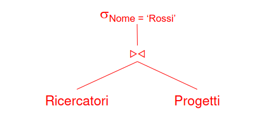
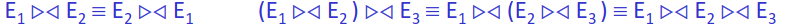
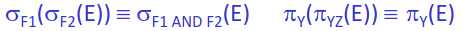
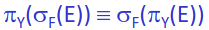
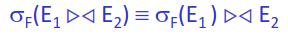
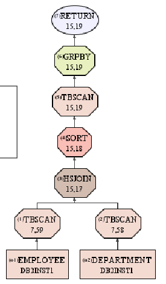
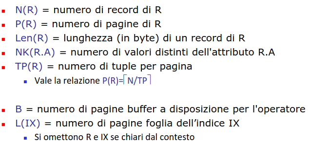
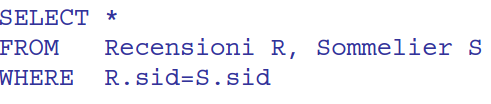

- problema in continua evoluzione
- vi è una parte tecnologica consolidata
- ## STORIA
	- ### anni 60
		- ricerche che coinvolgono chiavi primarie
	- ### anni 70
		- rivoluzione del [[B+TREE]]
	- ### anni 80
		- nuove tipologie di dati
		- nascono indici multidimensionali
		- ricerche di vicinanza e similarità
	- ### anni 90
		- sistemi eterogenei (*con dati di diversa natura*)
	- ### nuovo millennio
		- tecnologie di intelligenza artificiale utilizzate in ambito database
		- nuove architetture per big data
		- enfasi sull'analisi della qualità dei dati
		  :LOGBOOK:
		  CLOCK: [2023-04-12 Wed 11:30:51]--[2023-04-12 Wed 11:30:52] =>  00:00:01
		  :END:
- ## ALGEBRA RELAZIONALE
	- ### DIFFERENZE CON MODELLO PROPOSTO DA SQL
		- le relazioni sono insiemi (*no dati duplicati*) (*no insiemi*)
	- definita da un insieme di operatori che producono relazioni a partire da relazioni
	- ### OPERATORI
		- #### selezione
		  collapsed:: true
			- restituisce un sottoinsieme di una relazione che  soddisfa un dato predicato
		- #### proiezioni
			- restituisce un sottoinsieme degli attributi di una relazione
		- #### join
			- combina le tuple di due relaizoni in base all'uguaglianza di attributi comuni (*con lo stesso nome*)
		- #### theta-join
			- combinazione di prodotto cartesiano e selezione
		- #### unione
			-
		- #### differenza
	- ### RAPPRESENTAZIONE AD ALBERO
		- possibile rappresentare le operazioni algebriche ad albero
		- valutato in maniera bottom-up
		- 
	- ### EQUIVALENZA DI ESPRESSIONI
		- due espressioni sono equivalenti quando producono la stessa relazione
		- #### regole di equivalenza
			- ##### join associativo e commutativo
				- 
			- ##### selezione e proiezione si possono raggruppare/decomporre
				- 
			- ##### selezione e proiezione sono commutabili
				- 
				- *solo se la selezione è eseguita su Y*
			- ##### push down della selezione rispetto al join
				- 
				- push down molto importante per l'ottimizzazione
				- possibile eseguirlo anche con la proiezione
	- ### ELABORAZIONE DI QUERY MEDIANTE OPERATORI
		- operatori come mattoncini per comporre la risoluzione della query
		- necessario avere un implementazione efficiente degli operatori
		- necessario trovare la migliore combinazione degli operatori che consente di risolvere la query
		- #### OPERATORI LOGICI VS OPERATORI FISICI
			- ##### operatori logici
				- operatori relazionali
			- ##### operatori fisici
				- implementazione degli operatori logici
		- #### VIE DI ACCESSO
			- insieme di step necessari per recuperare le tuple di una relazione
				- ##### scansione sequenziale
				- ##### accesso tramite indici
		- #### PIANI DI ACCESSO
			- insieme di operazioni per accedere ai dati
			- fa uso di operatori logici
			- presenta rappresentazioni  del costo delle operazioni (*caso DB2 timeron contiene sia costi di IO che di CPU*)
			- 
			- ##### tempi di esecuzione
				- l'ottimizzatore non considera i tempi di esecuzione di una query ma il costo del suo piano d'accesso dato che i tempi di esecuzione sono influenzati da tantissimi fattori
		- #### PARAMETRI DI COSTO
			- necessario per valutare la qualità delle diverse possibilità di risoluzione necessario usare parametri che si originano dalle statistiche dei dati
			- 
	- ### OPERATORI LOGICI
		- [[SORT]]
		- [[SELEZIONE]]
		- [[PROIEZIONE]]
		- # JOIN
			- supponiamo di avere query del tipo
			- 
			- eseguire il prodotto cartesiano per poi applicare il predicato è **molto inefficente**
			- molte possibili varianti
			- ## NESTED LOOP JOIN
				- si confronta ogni record di un input con ogni  record dell'altro input
				- 
				-