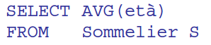
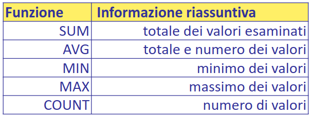

- supponiamo di avere una query del tipo
- 
- l'algoritmo tiene traccia delle informazioni parziali in base all'operatore
- 
- si può sfruttare la presenza di un **indice per ottimizzare** le query