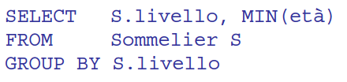

- supponiamo di avere una query del tipo
- 
- necessario partizionare
- ### SORTING
	- il costo puo essere ridotto **raggruppando gia nella fase di sort**
	- mantentendo per ogni valore di raggruppamento le informazioni riassuntive
	- si faccia riferimento a [[PROIEZIONE]]
	-
- ### HASING
	- si faccia riferimento a [[PROIEZIONE]]
- ### INDICE
	- si faccia riferimento a [[PROIEZIONE]]
-
-
-
-
-