- ## CATALOGHI DI SISTEMA
	- tabelle in un loro spazio dei nomi **contengono i metadati** sul DB
	- schemi rilevanti
		- ##### SYSCAT
			- DB2 realizza lo standard  tramite le viste contenute in questo schema
		- ##### SYSSTAT
			- tabelle che contengono informazioni sul sistema
- ## RAPPRESENTAZIONE INTERNA DI UNA QUERY
	- la query viene rappresentata internamente come un albero
	- 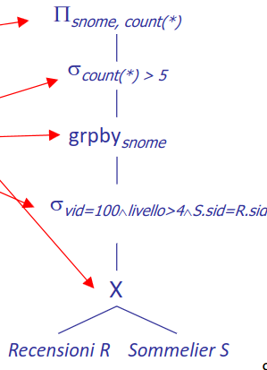
	- ### REWRITING
		- prima di qualunque cosa la query viene riscritta (*ottimizzazione semantica*)
		- lo scopo è quello di semplificare la query
		- le operazioni svolte sono
			- #### RISOLUZIONE DELLE VISTE
				- eliminazione delle liste
				- ##### esempio
					- 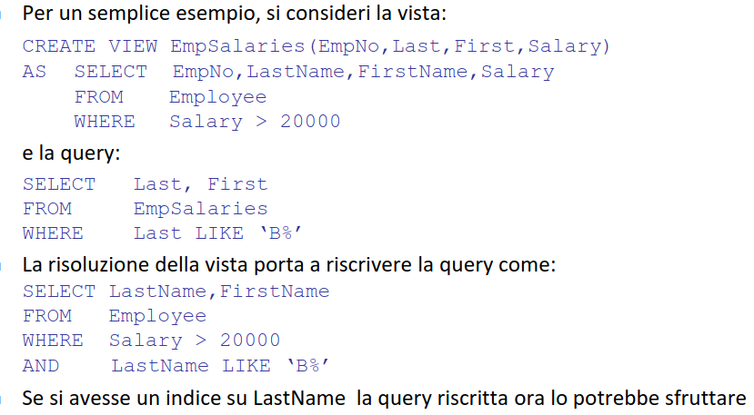s
			- #### UNNESTING
				- si cerca di rimuovere le subquery
				- ##### esempio senza correlazione
					- 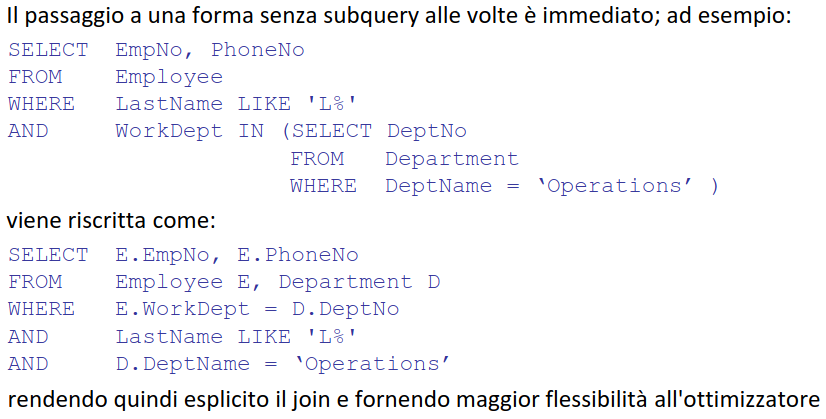
				- ##### esempio con correlazione
					- 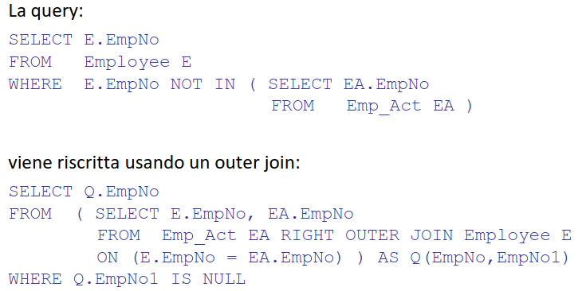
			- #### USO DEI VINCOLI
				- si sfruttano i vincoli sui dati per semplificare la query
				- ##### esempio
					- 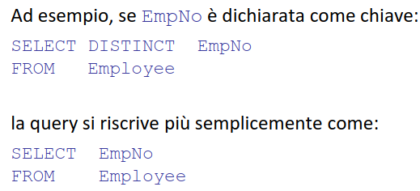
					- 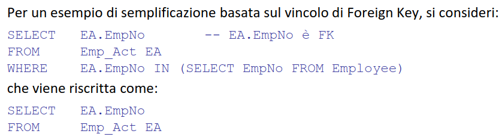
	- ### OTTIMIZZAZIONE
		- la fase che partendo dalla query riscritta genera un ((643ff00e-c706-4785-b008-330d570e6ece)) ovvero un albero di ((643ff00e-6492-49d1-b46b-a360d995014f))
		- 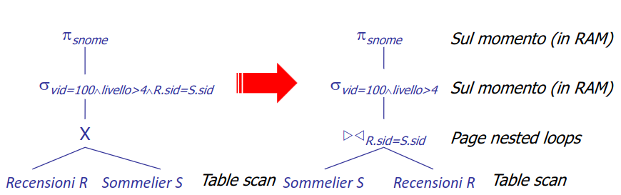
		- ### ESECUZIONE DEL PIANO DI ACCESSO
			- due possibilità di esecuzione
			- #### PER MATERIALIZZAZIONE
				- ogni operatore genera il risultato in una tabella temporanea
				- non parallelizzabile
				- le tabelle generate possono richiedere operazioni di IO
				- ##### esempio
					- 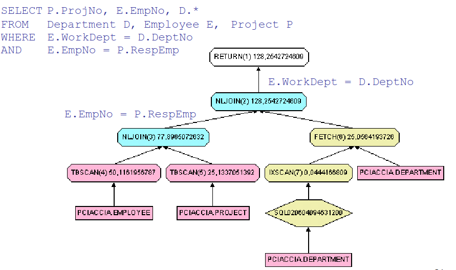
					- 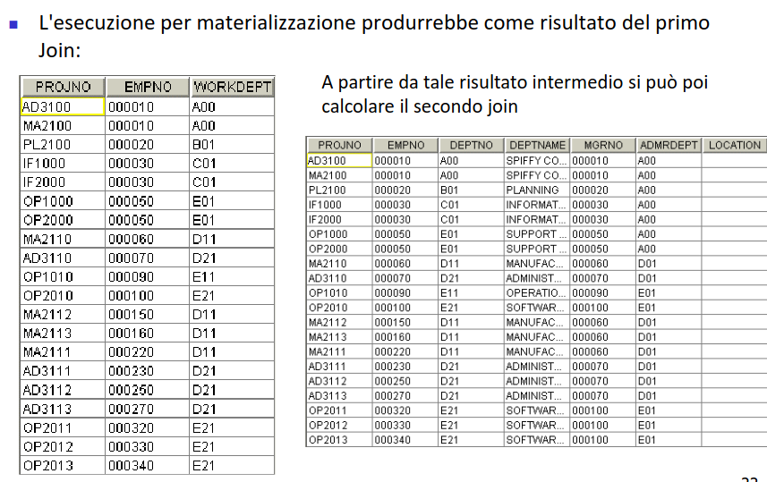
			- #### IN PIPELINE
				- gli operatori sono inseriti in una sorta di pipeline
				- ogni operatore richiede i dati agli operatori in input
				- piu efficiente
				- non sempre possibile (*operatore sort*)
				- ##### esempio
					- 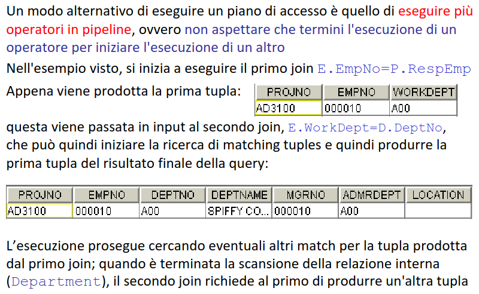
			- #### INTERFACCIA ITERATORE
				- per semplificare il codice di ordinamento si usa un interfaccia standardizzata per gli operatori
					- ##### OPEN
					  id:: 6448f80e-f8e9-4d24-b645-c4a68d7bcc9b
						- inizializza, alloca buffer, passa parametri e richiama ricorsivamente open sui figli
					- ##### HASNEXT
						- verifica se ci sono altre tuple
					- ##### NEXT
						- richiede la prossima tupla
					- ##### RESET
						- riparte dalla prima tupla
					- ##### CLOSE
						- termina e rilascia le risorse
			- #### DIGRESSIONE SCOPO OTTIMIZZAZIONE
				- lo scopo del'ottimizzazione è quello di ottenere il **totale dei risultati il prima possibile**
				- di conseguenza viene scelto il piano di accesso che fornisce prima il totale degli operatori
				- è possibile variare questo comportamento tramite parametri
		- ### RICERCA PIANO DI ACCESSO OTTIMALE
			- vengono enumerati i possibili piani di accesso in uno spazio di ricerca
			- si cerca di non considerare i piani di accesso notoriamente non ottimali
			- punto fondamentale sapere **quanto un operatore è selettivo**
			- l'approccio più diffuso è quello di mantenere statistiche sui cataloghi e sfruttarle al momento di determinare quale piano di accesso è migliore
			- #### CALCOLO SELETTIVITÀ PREDICATI
				- 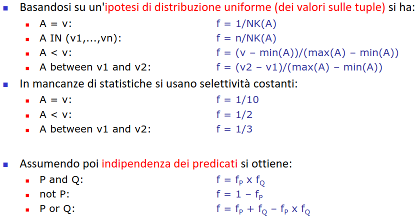
			- #### SELETTIVITA CON PIU PREDICATI
				- 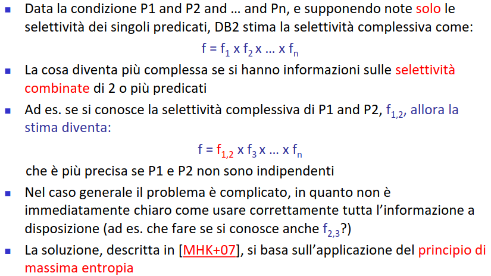
				- #### SELETTIVITA DEL JOIN
					- per join di uguaglianza si assume che la relazione con meno valori trovi match in quella con piu valori
					- ```
					  (N(R)*N(S))/NK(R.A)
					  ```
					- #### JOIN PRIMARY KEY FOREIGN KEY
						- in questo caso dato che il numero di valori distinti di R è uguale alla sua cardinalità allora il fattore di selettività risulta `N(S)`
				- #### CARDINALITÀ DELLA PROIEZIONE
					- 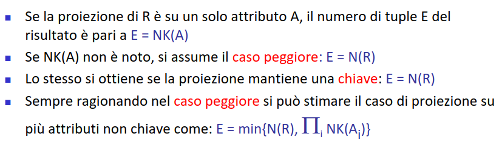
					- #### STIMA DEL NUMERO DI VALORI DISTINTI
						- #### LINEAR COUNTING
							- 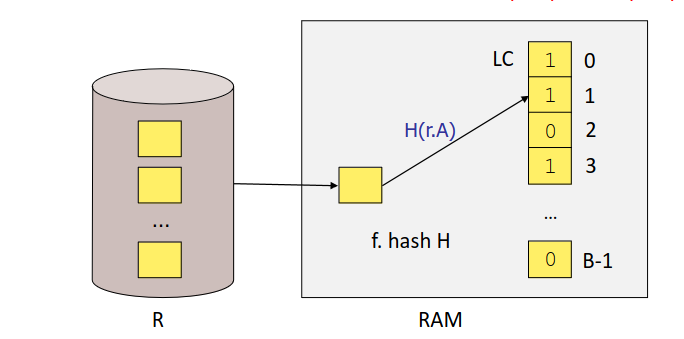
							- `NK(R.A) ~= B ln (B/Z)`
				- #### CARDINALITÀ PROIEZIONI MULTI ATTRIBUTO
					- si sfrutta un modello basato sulla formula di cardenas
					- `NK(A)*NK(B)*[1-(1-1/(NK(A)*NK(B)))N(R)]`
			- #### OPERATORI INSIEMISTICI
				- TODO inserire parte operatori insiemistici
- ## ISTOGRAMMI
	- per ovviare alla approssimazione della stima dei valori distinti di un attributo si sfruttano **istogrammi**
	- coniste in B intervalli (*bucket*) che **partizionano l'insieme** di valori di un attributo
	- 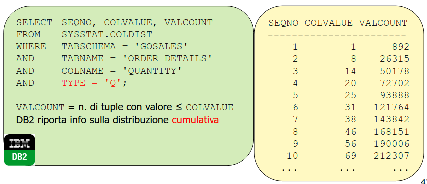
	- ### TIPOLOGIE
		- #### EQUI-WIDTH
			- il dominio è suddiviso in `B` intervalli della **stessa ampiezza**
			- semplici da aggiornare
			- no garanzie sull'errore
			- 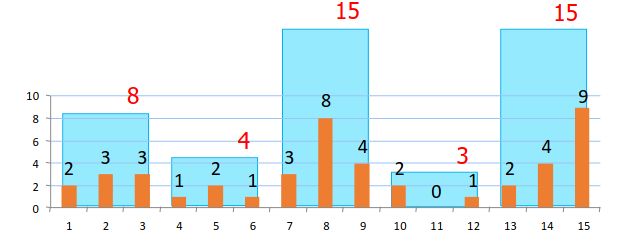
		- #### EQUI-DEPTH
		  id:: 644a4d2a-9104-4d02-ac06-f501a32204ab
			- il dominio è suddiviso in `B` intervalli con numero di elementi per ogni intervallo sia **circa lo stesso**
			- piu onerosi da aggiornare
			- in grado di adattarsi a distribuzioni non uniformi
			- 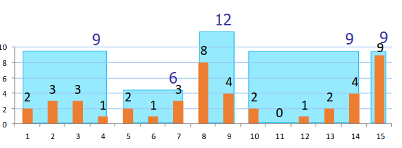{:height 195, :width 507}
		- #### COMPRESSED
			- estensione degli ((644a4d2a-9104-4d02-ac06-f501a32204ab)) in cui viene mantenuto un contatore separato per i valori più frequenti
	- ### CONOSCENZA DELLA DISTRIBUZIONE DEI VALORI
		- la conoscenza della distribuzione dei valori ci consente di stimare meglio di ciò che consente di fare la formula di cardenas
- ## CARDINALITA DI RELAZIONI DERIVATE
	- stimare la cardinalita di relazioni derivate da piu operatori diventa sempre piu complesso dato che gli errori sulle stime delle cardinalita degli operatori si accumulano
	- 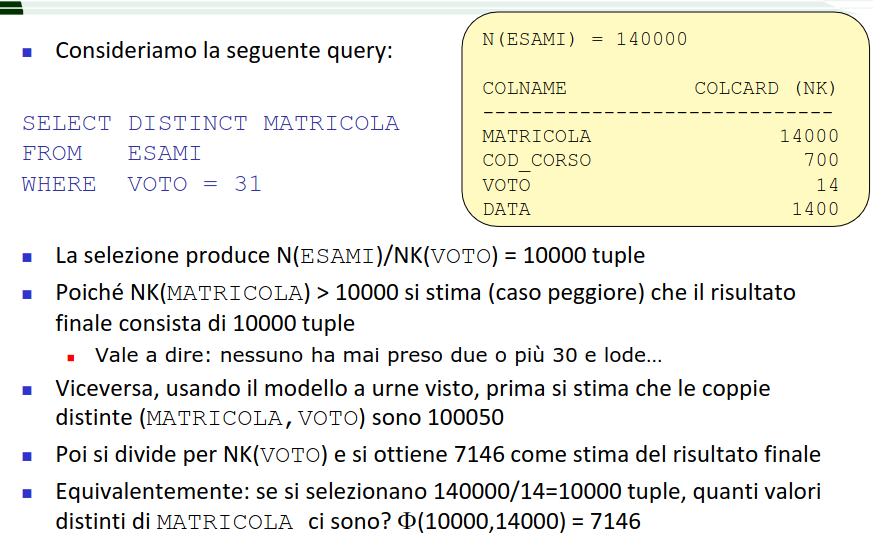
- ## OTTIMIZZAZIONE DI QUERY SU SINGOLA RELAZIONE
	- Ci sono 4 possibili soluzioni
		- Scansione sequenziale
		- Uso di un solo indice (*eventualmente clustered*)
		- Uso di più indici
		- Uso solo di un indice (*index-only plan = non si accede ai dati*)
	- 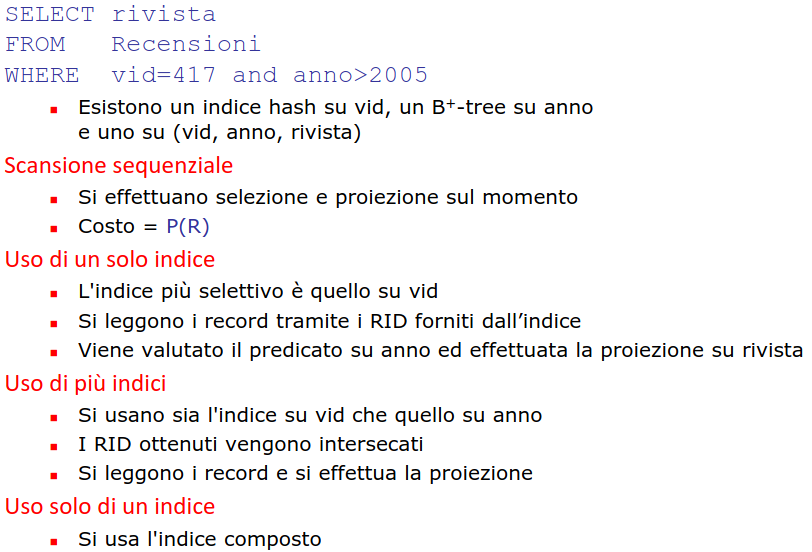
	  id:: 644a55d7-2c05-4d50-820a-e61628d9d0c5
- ## QUERY SU PIÙ RELAZIONI
	- problema fondamentale determinare **l'ordine in cui eseguire il join**
	- spazio di ricerca è **esponenziale in N**
	- 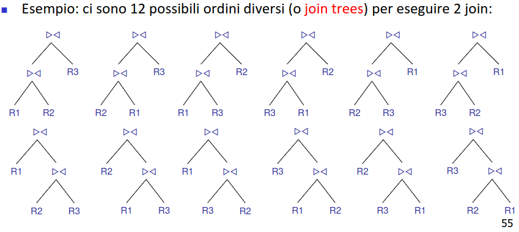
	- necessario determinare il numero di alberi diversi generabili
	- 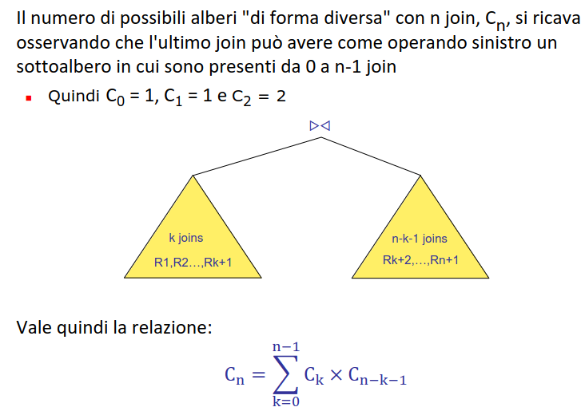
	- 
	- 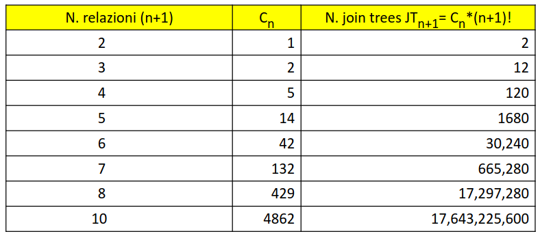
	- ### PROGRAMMAZIONE DINAMICA
		- basata sul principio di ottimalita
		- dati 2 percorsi parziali P1 e P2 che hanno origine in S e arrivano entrambi in un nodo V, se costo(P1) < costo(P2), allora **P2 non può essere esteso in modo tale da generare un percorso di costo minimo da S a T**
		- una soluzione ottimale è a sua volta composta da sotto soluzioni ottimali
		- ##### PREMESSA
			- ogni nodo di un piano di accesso è a sua volta un piano di accesso parziale
		- #### proprieta piano di accesso
			- Relazioni elaborate
			- Schema (set di attributi)
			- Predicati applicati
			- Costo
			- Cardinalità
			- Ordine
		- le proprieta di un nodo sono date da `f(proprieta dei figli, operatore del nodo)`
		- ### ALGORITMO DP
			- Passo 1: determina per ogni relazione Ri il piano parziale migliore
			- Passo k (k = 2,...,n): per ogni sottoinsieme di k relazioni determina il piano migliore, a partire dai soli piani selezionati nei passi precedenti, ossia combinando i piani ottimali per i e k-i relazioni (i=1,...,k-1)
		- ancora il numero di join tree risulta esponenziale comunque si ottiene un ottimo miglioramento
		- 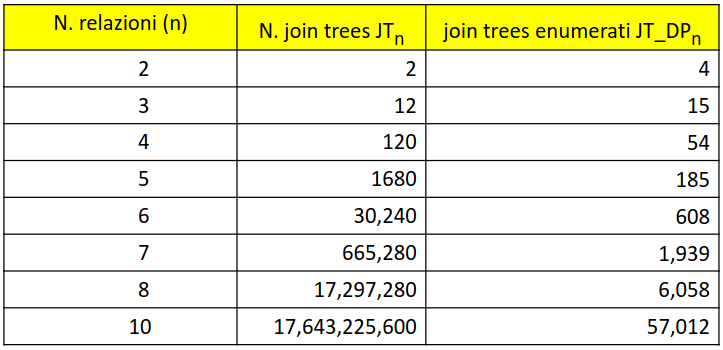
	- ### RIDUZIONE DELLO SPAZIO DI RICERCA
		- si possono sfruttare tecniche euristiche per
		- #### LEFT DEEP JOIN TREE
			- 
			-
			- In questo modo è molto più semplice generare piani che lavorano in pipeline (*si può usare index nested loops*)
			- Euristica comunemente adottata a partire da System R
			-
	-
	-