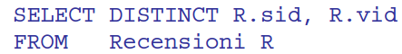
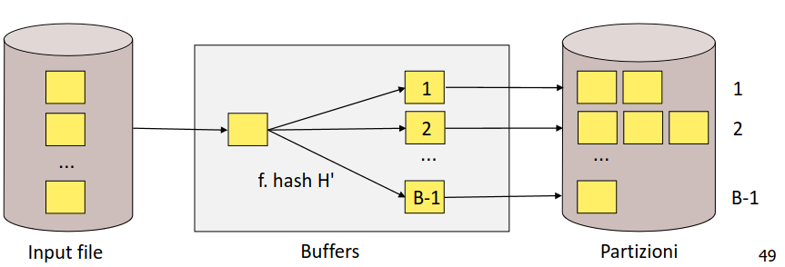

- query del tipo
- 
- ## SORTING
	- si scandisce r e si rimuovono gli attributi non richiesti
	- si ordina il file
	- si rimuovono i duplicati
	- 
- ## USARE HASING
	- ### FASE DI PARTIZIONAMENTO
		- si adotta quando si ha un numero di buffer molto grande
		- si leggono le pagine e si usa una funzione hash e si ridistribuiscono i risultati su file
	- ### FASE DI ELIMINAZIONE DEI DUPLICATI
	- si leggono in sequenza i file generati e si applica una nuova funzione hash (*diversa dalla prima* ) e si redistribuiscono i record nelle pagine e si eliminano i duplicati
	- 
	- l'ipotesi è che nella seconda fase **non si debbano salvare le pagine su disco**
	- il numero di pagine del file di input deve essere minore di `(B-1)^2`
	- #### CONFRONTO SORT VS HASH
		- la proiezione sort merge risulta migliore nel caso in cui siano presenti molti duplicati oppure quando la distribuzione hash risulta disomogenea
- ### USARE INDICE
	- occorre che tutti gli attributi mantenuti siano contenuti anche nell'indice
	- si applicano le tecniche precedenti ma **su i dati dell'indice senza accedere al file dati**
	-
-