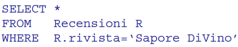
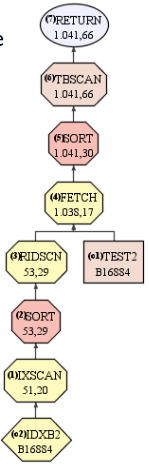
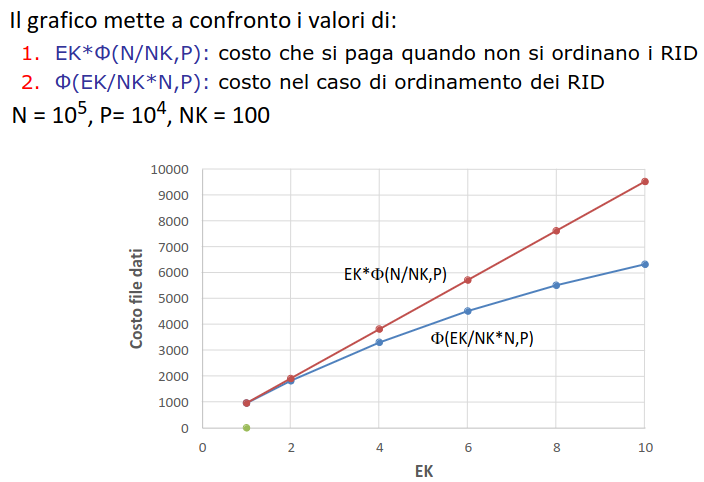
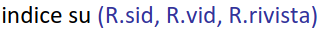
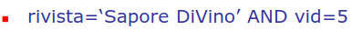
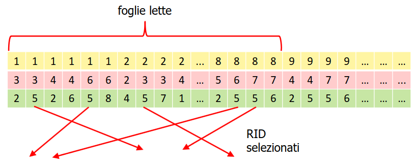
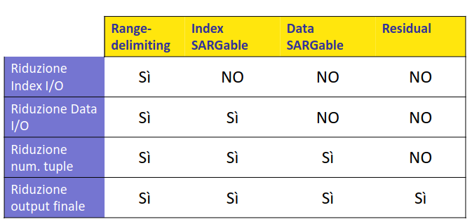
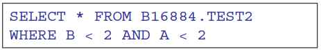
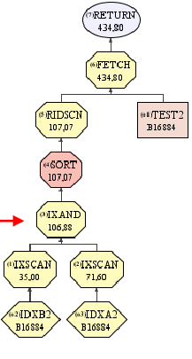

- data la seguente query
- 
- qual'è il miglior metodo risolutivo?
- diversi fattori in gioco tra cui
	- **numero dei record nel risultato**
	- **presenza degli indici**
	- **tipologia degli indici**
- ## STIMA DEL NUMERO DI RISULTATI
	- stima secondo la formula E = f*N
		- N numero di **record in imput**
		- f è il **fattore di selettività** del predicato usato nella selezione
	- come si stima il **fattore di selettivita** ?
		- se si assume che l'attributo coinvolto nella selezione sia uniformemente distribuito allora **f=EK/NK**
		- con **EK = numero di valori attesi nel risultato**
		- sistema molto fragile da usare solo in assenza di altro
- ### COSTO
	- in assenza di indice necessario leggere tutto il file dati
	- se si usa un b+tree  allora il costo è **h-1+f*L + costo file dati**
	- se l'indice è ((6421c859-1c54-4305-9f8e-1fbd53a0d872)) costo file dati = **f*P**
	- se l'indice è unclustered costo file dati = **EK*f(N/NK,P)**
	- se si ha un indice hash il costo è **1 + costo file dati**
- ## VARIANTE CON INDICE UNCLUSTERED
	- in caso di predicati che contengono molti record su piu chiavi puo convenire **ordinare i RID prima di accedere al file dati**
		- Scandisci l'indice e reperisci tutte le coppie (k,RID) che soddisfano il predicato
		- Ordina le coppie per valore di RID crescente
		- Scandisci il file dati ordinatamente, usando i RID
	- 
	- 
- ## SELEZIONE CON CONDIZIONE COMPLESSA
	- se la clausola where fa riferimento a piu attributi si procede come segue
		- si riscrive la condizione in **forma normale congiuntiva** (*A and B and (C or D)*)
			- in questo modo si può scartare subito parte dei record che non soddisfano il predicato
		- quindi si valuta se **esiste un indice in grado di risolvere la condizione riscritta in CNF**
		- ### INDICI HASH
			- si possono usare se **la query presenta gli stessi attributi dell'indice oppure attributi aggiuntivi**
			- in caso di attributi aggiuntivi si risolve con un passaggio ulteriore in RAM
		- ### INDICI B+TREE
			- si possono usare anche **se la query presenta un numero di attributi inferiori**
			- condizione: **la query deve contenere un termine per ogni attributo di un prefisso della chiave dell'indice**
			- ##### esempio
				- 
				- 
- ## TIPOLOGIE DI PREDICATI
	- si distinguono 4 tipi di predicati
		- ### RANGE DELIMITING
		  id:: 6437e3ed-a9f4-4c47-8307-de5c5449a0bd
			- delimitano il range di foglie da accedere
		- ### INDEX SARGABLE
		  id:: 6437e3fa-9079-4c4f-8721-cdadd3db9312
			- non limitano il numero di foglie ma si possono sfruttare se si accede tramite indice
		- ### DATA SARGABLE
			- predicati in cui l'indice non ha utilità sfruttabili solo dopo caricamento in memoria
		- ### RESIDUAL
			- non valutabili (*subquery*)
	- ((6437e3ed-a9f4-4c47-8307-de5c5449a0bd)) vs ((6437e3fa-9079-4c4f-8721-cdadd3db9312))
		- 
	- ### EFFETTI DEI 4 TIPI DI PREDICATI
		- 
- ## SELEZIONE SENZA DISGIUNZIONI
	- query con selezione su predicati disgiuntivi
	- 
	- in questi casi si possono sfruttare piu indici e eseguire l'intersezione dei RID
	- 
	- all'aumentare del numero di indici utilizzati **si riduce il costo dati ma aumenta il costo degli indici**
- ## SELEZIONE CON DISGIUNZIONI
	- se anche una sola condizionenon è risolubile con indice è necessario scandire il file
	- se tutte le condizioni in OR sono risolubili con indice si risolvono facendo l'unione (*potenzialmente facendo l'unione dei RID*)
	-