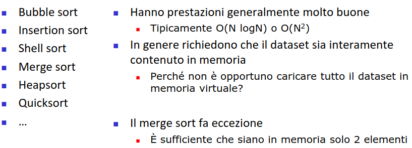
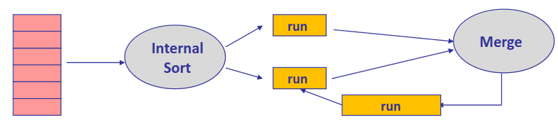
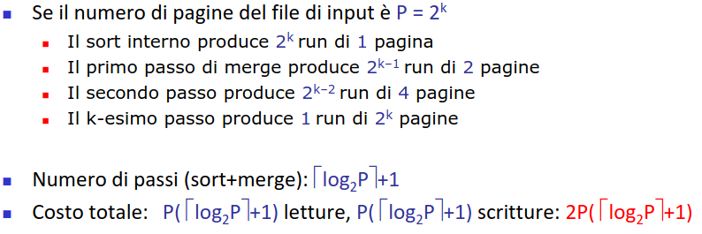
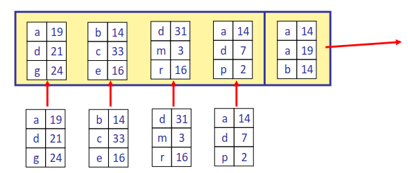
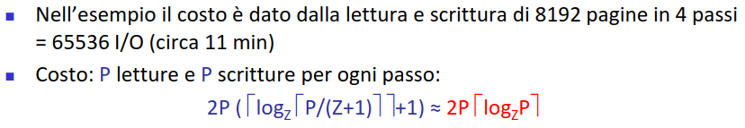
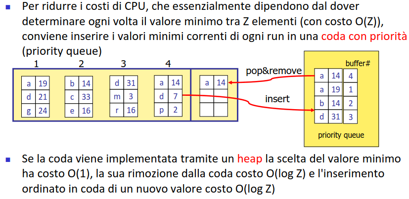
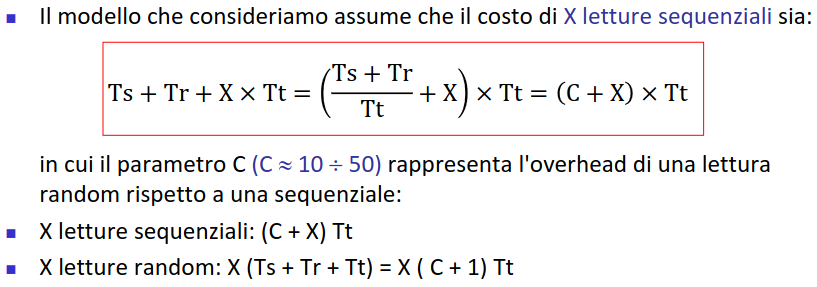
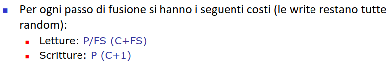

- necessario per risolvere query di order by
- utile per risolvere join e group by
- ##### ALGORITMI DI SORT INTERNI (*MEMORIA RAM*)
  id:: 64368e5d-dd90-4a67-845e-96e561a1c188
	- 
- ##### SORT-MERGE ESTERNO
	- suddividere i dati in sequenze ridotte **RUN**
	- ordinare le sequenze una a una con un ((64368e5d-dd90-4a67-845e-96e561a1c188))
	- fondere le sequenze una a una un elemento per volta (*merge*)
	- 
	- ###### COSTO
		- 
	- costi troppo elevati necessario ridurre i costi
- ##### SORT MERGE A Z VIE
	- i buffer di ordinamento vengono sfruttati tutti anche nella fase di merge
	- il confronto viene eseguito fra z elementi
	- {:height 258, :width 588}
	- ###### COSTI
		- 
		- il sistema tuttavia risulta esoso in termini di cpu (*alto numero di confronti*)
		- possibile ridurre il costo tramite una **coda**
		- 
	- ###### TIPI DI LETTURE
		- per ottimizzare necessario distinguere tra operazioni random e sequenziali
		- si prevengono letture inefficienti
		- 
		- costo di sort interno
		- 
		- 
		-
		-
	-
	-
	-