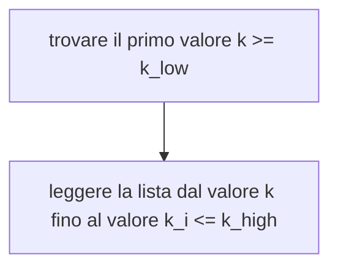
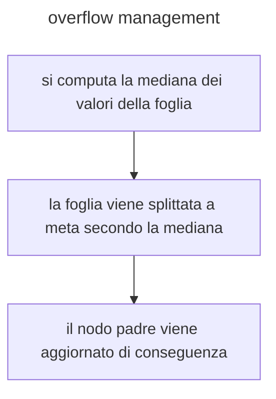
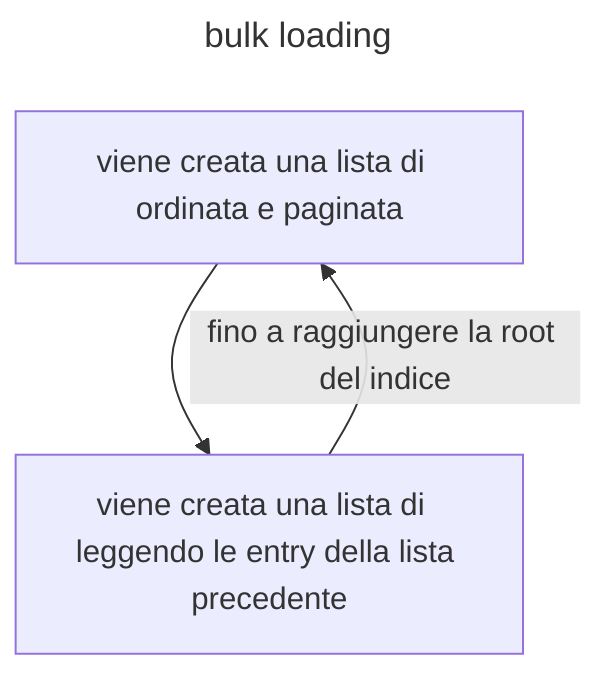

# Migliorando i [b-tree](b-tree.md): B+tree

I b+tree sono b-tree in cui le tuple sono contenute solo nelle foglie dell'albero, le foglie sono inoltre contenute in una lista linkata(*possibilmente sfruttando il PID*) per migliorare l'accesso al file

## Range search con i B+tree

Dato che le foglie sono contenute in una lista linkata per effettuare ricerche range e sufficiente:



## B+tree inserimento

In caso di inserimento si ripercorre l'albero fino alla foglia dove deve essere inserito l'albero, se la foglia e piena (*$2D$ elementi*) allora si ha una situazione di **overflown**, che viene gestita come segue



>[!NOTE] nel caso anche il nodo padre sia pieno, si procede ricorsivamente fino alla radice

Questo procedimento e molto costoso (al massimo $2h +1$ letture), strategie alternative prevedono di cedere delle foglie ai nodi vicini, questo comporta un grosso costo in termini di dati letti in quanto si compiono molte più scritture

## Cancellazione

La cancellazione segue le stesse logiche dell'inserimento ma in questo caso il problema si ha quando la foglia contiene $n \lt d$ foglie, si ha un caso di **underflown** che viene gestito come segue

- si redistribuiscono le foglie dei nodi vicini
- si elimina il nodo (*possibile solo se le foglie del nodo sono $d$ oppure $d+1$*)

## Occupazione in memoria

Ogni nodo intermedio contiene  al più $2d$ chiavi e $2d+1$ PID, di conseguenza l'ordine dell'albero e uguale a 

$$
d = \Big\lfloor \frac{pagesize - PIDsize}{2(keysize + PIDsize)}\Big\rfloor
$$

L'ordine dei nodi foglia e dato

$$
d_{leaf} = \Big\lfloor \frac{pagesize - 2PIDsize}{2(keysize + RIDsize)}\Big\rfloor
$$

Di conseguenza il numero di nodi foglia e uguale a

$$
NL = \Big\lceil \frac{N}{d_{leaf} \ast u}\Big\rceil
$$


se l'attributo chiave non e unico liste di rids, se le liste sono lunghe si può optare per liste di PIDs efficienti se indice clustered, in caso di campi variabili l'ordine viene meno, necessario fare considerazioni sul nodo compressione delle chiavi

## Ricerche multi attributo

Prendendo in considerazione una query come segue

```sql
SELECT FROM persone
WHERE cognome = "rossi"
AND anno > 1990
```

Si possono sfruttare indici in diverse modalità per accedere ai dati

- usare un indice su uno dei due attributi e verificare la condizione sull'altro
- usare due indici e calcolare l'intersezione dei due risultati

entrambi i sistemi possono vanificare il vantaggio di usare indici, un alternativa consiste nell'usare **indici multi attributo** 

> [!WARNING] tali indici non sono vantaggiosi per fare ricerche ranged sui successivi $n-1$ campi della chiave

E inoltre necessario valutare l'uso di tali indici con criterio in quanto se si hanno $n$ attributi il numero di possibili indici multi attributo e pari a $n!$, non il massimo per l'occupazione del disco

## Bulk loading

Gli indici vengono creati a db esistente (*in corsa*), e dunque necessario ottimizzarne la creazione



## Performance come indice secondario

Nel caso il B+tree venga utilizzato come indice secondario e necessario determinare

- quante foglie contengono il risultato di una query
- quante pagine dati contengono record risultato

>[!NOTE] si assume che i valori della chiave siano distribuiti in maniera uniforme e che i record nelle pagine siano a loro volta distribuiti in maniera uniforme 


### Modello di cardenas

Il numero di pagine in media a cui e necessario accedere per recuperare $R$ in $P$ pagine e dato dal seguente modello

$$
\Phi(R,P)=P(1-(1-\frac{1}{P})^R) 
$$

Tale modello assume pagine di dimensione infinita, che porta a una sottostima nel numero effettivo di pagine da leggere

### Superando cardenas: il modello di Yao

Il modello di Yao tiene in considerazione anche la capacita $C=N/P$ delle pagine, si ha che il numero di pagine da accedere in media e dato da

$$
\Phi(R,N,C) = NP \times (1- \frac{\binom{N-C}{R}}{\binom{N}{R}})
$$

Sotto le assunzioni precedenti e dimostrabile che la formula di Yao sovrastima i costi di accesso, tuttavia per query che implicano un alto numero di record $R$ Il modello di Yao e piu costoso del modello di Cardenas


[PREVIOUS](pages/b-tree.md) [NEXT](pages/GiST.md)
