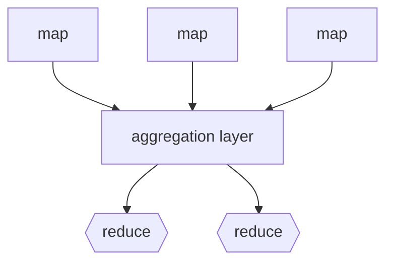

# Big data architectures

Si parla di big data quando il volume di dati da amministrare supera le capacita di storage e gestione dei normali sistemi DBMS, possibili contesti sono:

- analisi di dati per infrastrutture IOT
- analisi di dati di grandi banche dati
- accentratori di flussi di dati

In queste situazioni il paradigma si sposta da un potenziamento della singola istanza che gestisce il dato a un aumento del numero di istanze (*scale out non scale up*) 

Questo porta alla necessita di gestire i dati all'interno di cluster di macchine connesse in rete e limitare i flussi di trasferimento di dati non necessari, aumentando il numero di macchine e di componenti hardware aumentano anche le probabilità che ci siano guasti hardware e software, e necessario pensare sistemi in grado di operare in ambienti ostili

## Gestire i dati in infrastrutture distribuite: Distributed Filesystem DFS

Per gestire i dati in questi scenari si fa uso di filesystem distribuiti, questi adoperano secondo i seguenti principi

- i file sono divisi in chunks
- i chunk sono replicati nel cluster
- le copie sono distribuite in nodi distinti
- il file **master node** contiene informazioni di localizzazione delle copie
- il **master node** e replicato
- una **directory** sa dove e collocato il master node
- la directory e replicata
- tutti i nodi del cluster sanno dove sono le copie della directory

una delle implementazioni più note e quella di **HADHOOP** 

## Gestire la concorrenza: Map Reduce

Paradigma di sviluppo pensato per gestire la concorrenza in ambienti distribuiti come i datacenter, il codice viene suddiviso in due fasi:

- **map** i chunk di dati vengono convertiti in coppie `<key,value>`
- **reduce** le coppie con lo stesso  valore di `<key>` vengono raggruppate e combinate nel risultato

Le operazioni di map e reduce sono eseguite su nodi in parallelo,  secondo un paradigma SIMD

I nodi vengono assegnati al cluster in base a dove si trovano i dati in input interessati dall'elaborazione, in questo caso si utilizzano 

## Map reduce, execution

Al momento dell'esecuzione, il supporto runtime crea un processo **jobtracker** che a sua volta crea un certo numero di **tasktracker** distribuiti nei vari nodi del cluster
[PREVIOUS](pages/skyline_queries.md)
