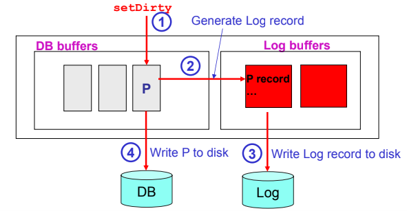
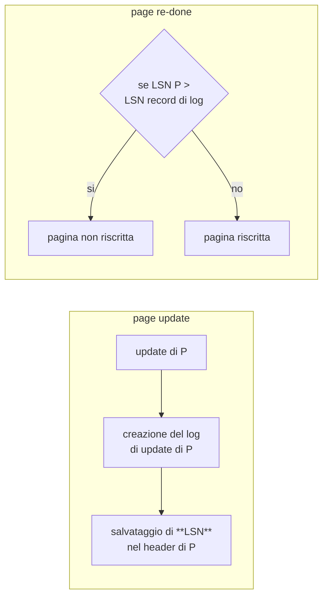
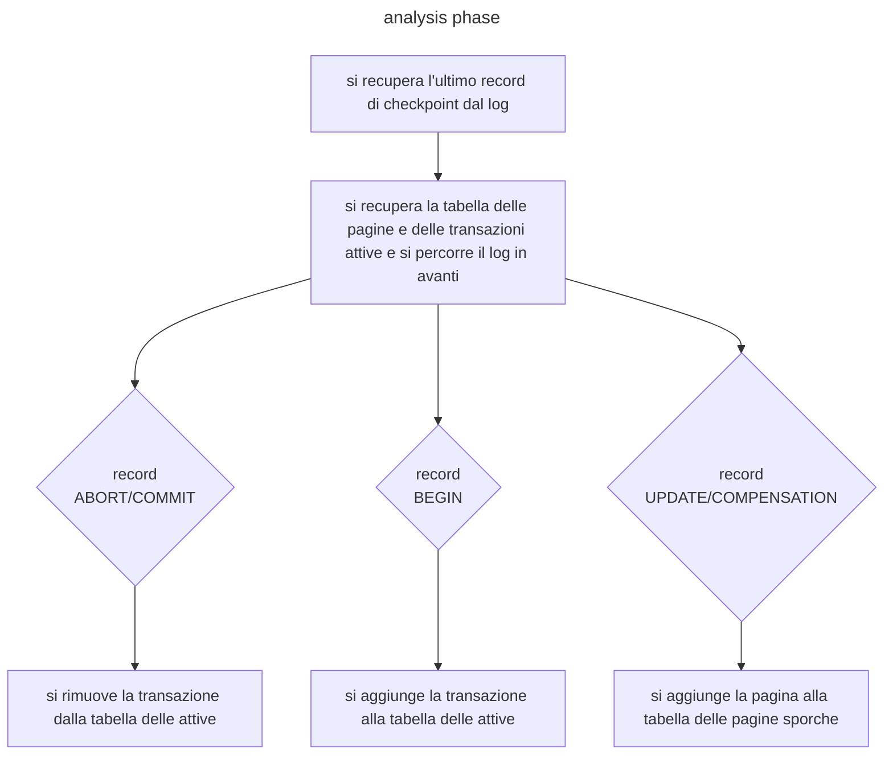
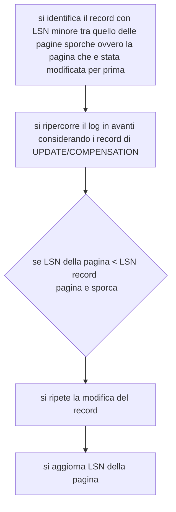
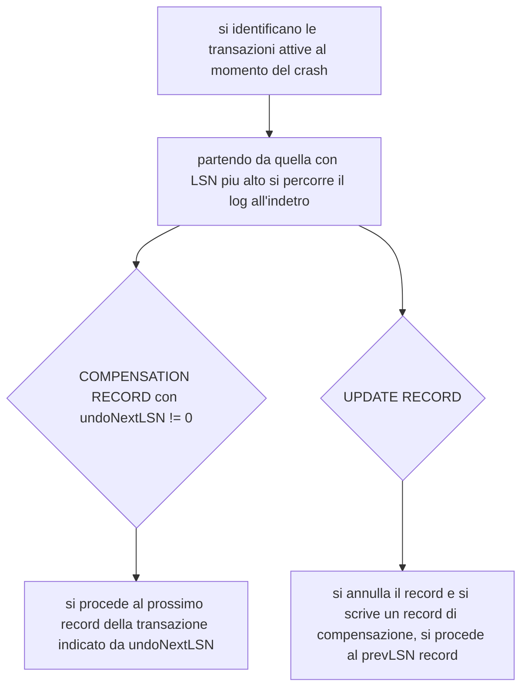

# Garantire la Durabilità di una transazione

Per poter garantire le proprietà di [atomicità e durabilità](transazioni.md#transazioni) di una transazione e necessario garantire che gli effetti di una transazione sopravvivano a un crash del sistema:

I crash del sistema si dividono in 3 tipologie:

- **transaction failures** transazioni fallite
- **media failures** fallimento del supporto fisico (*disco*)
- **system crashes** crash del sistema (*ram a tappo, crash applicativi*)

>[!NOTE] si presume che la scrittura di una pagina su disco sia un operazione atomica

## Politiche di gestione del buffer

Data una transazione $T$ che modifica una pagina $P$ il DBMS ha due possibilità per la gestione della stessa

- **no steal** le pagine modificate vengono scritte solo dopo che una transazione è terminata con successo
- **steal** le pagine vengono scritte quando è più opportuno con l'obbiettivo di ottimizzare l' I/O
>[!TIP] la politica di steal e quella prediletta da DB2

## Commit di una transazione

Anche nel caso in cui una transazione esegua il commit il DBMS ha due politiche di gestione principale

- **force** tutte le pagine sono scritte sul disco prima di considerare la transazione terminata
- **no force** la formalizzazione della terminazione di una transazione non attende la scrittura delle pagine
>[!TIP] la politica di no force e quella prediletta da DB2

## Gestione dei crash

Gli strumenti messi in campo dal DBMS per gestire i crash sono essenzialmente 2

| Database Dump                                                      | Log file                                                             |
| ------------------------------------------------------------------ | -------------------------------------------------------------------- |
| Viene effettuato un dump del DB periodico salvato su altro storage | file sequenziale dove vengono scritte le azioni di modifica dei dati |
> neanche a dirlo che il backup e fondamentale ....

## Log

raccoglie informazioni riguardanti le operazioni eseguite dalle transazioni, viene scritta una entry nel log nei seguenti casi:

- **update** aggiornamento di un record
- **commit** successo di una transazione
- **abort** fallimento di una transazione
- **end** terminazione di una transazione successiva a un commit/abort
- **compensation** recupero dello stato di una pagina già scritta su disco da parte di una transazione fallita

### Record di update

Il record di update per una transazione $T$ di una pagina $P$ e formato dai seguenti campi

| LSN(Log sequence number)  | prevLSN                                               | T                    | type                                      | PID                         | before(P)                          | after(P)                       |
| ------------------------- | ----------------------------------------------------- | -------------------- | ----------------------------------------- | --------------------------- | ---------------------------------- | ------------------------------ |
| id univoco del record  | indice del' record di log precedente che riguarda $T$ | id della transazione | tipo del record (*in questo caso update*) | PID della pagina modificata | immagine di P prima della modifica | immagine di P dopo la modifica |

### Record di compensation

Nel momento in cui le modifiche registrate in un record di update vengono eliminate viene creato un record di compensazione fatto come segue

| LSN(Log sequence number)  | prevLSN                                               | T                    | type                                      | PID                         | before(P)                          | undoNextLSN                                                                                                    |
| ------------------------- | ----------------------------------------------------- | -------------------- | ----------------------------------------- | --------------------------- | ---------------------------------- | -------------------------------------------------------------------------------------------------------------- |
| id univoco del record  | indice del' record di log precedente che riguarda $T$ | id della transazione | tipo del record (*in questo caso update*) | PID della pagina modificata | immagine di P prima della modifica | id del prossimo record da annullare, per esempio se si annulla il record $U$ allora $undoNextLSN = prevLSN(U)$ |

## Quando scrivere nel log: protocollo WAL

Per far si che il log risulti efficace il DBMS per ogni operazione deve scrivere sul log **PRIMA** di salvare le modifiche di una pagina sul disco (*write-ahead logging*)

La responsabilità di garantire il WAL e affidata al [buffer manager](struttura_database.md#Struttura%20fisica)

## Log e gestione dei fallimenti delle transazioni

Grazie al log e possibile gestire i fallimenti di una transazione anche con politica [steal](#Politiche%20di%20gestione%20del%20buffer), e sufficiente ripercorrere il log all'indietro e annullare tutte le operazioni di update della transazione

## Log e gestione dei fallimenti di sistema

In caso di fallimento di sistema tutte le transazioni che non hanno scritto nel log il record di [commit](#Log) vanno annullate, inoltre se si applica la politica di [no force](#Commit%20di%20una%20transazione) e possibile che alcune pagine $P$ di una transazione $T$ committata non siano state scritte nel disco, e necessario dunque rifare queste transazioni

### Evitare di riscrivere pagine già scritte

Per evitare di riscrivere tutti i parametri $After$  delle pagine di una transazione da rifare si adotta il seguente approccio

### Record di Checkpoint

Per ottimizzare la procedura di [restore](#Log%20e%20gestione%20dei%20fallimenti%20di%20sistema) da un fallimento di sistema si introduce nel log un record di checkpoint periodicamente, dove vengono inserite la **tabella delle dirty pages** e la **tabella delle transazioni**

>[!TIP] in questo modo set $T$ e stata committata prima del record di checkpoint non deve essere rifatta

## Algoritmo ARIES e gestione della recovery

L'algoritmo di ARIES consente l'utilizzo di politiche di [steal](#Politiche%20di%20gestione%20del%20buffer) e [no force](#Commit%20di%20una%20transazione), si divide in 3 fasi principali

- **analisi** viene determinato un insieme di pagine e transazioni attive al momento del crash
- **redo** ripete tutte le azioni a partire da un dato punto del log
- **undo** annulla tutte le azioni svolte da transazioni abortite

### Fase di analisi

Nella fase di analisi l'obbiettivo e quello di ripristinare lo stato delle pagine e della tabella delle transazioni al momento del crash, si procede come segue:

### Fase di redo

Nella fase di redo si svolgono tutte le modifiche alle pagine effettuate prima del crash

### Fase di undo

In questa fase tutte le transazioni attive al momento del crash vengono annullate

>[!TIP] scrivere [compensation record](#Log) nella fase di undo semplifica la procedura in caso di guasti ripetuti, dato che si e in grado di comprendere alla prossima esecuzione della procedura che le modifiche alle pagine sono già state apportate

[PREVIOUS](pages/transazioni.md) [NEXT](pages/operatori_relazionali.md)
