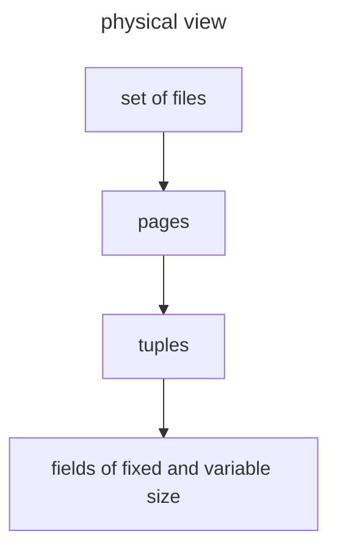
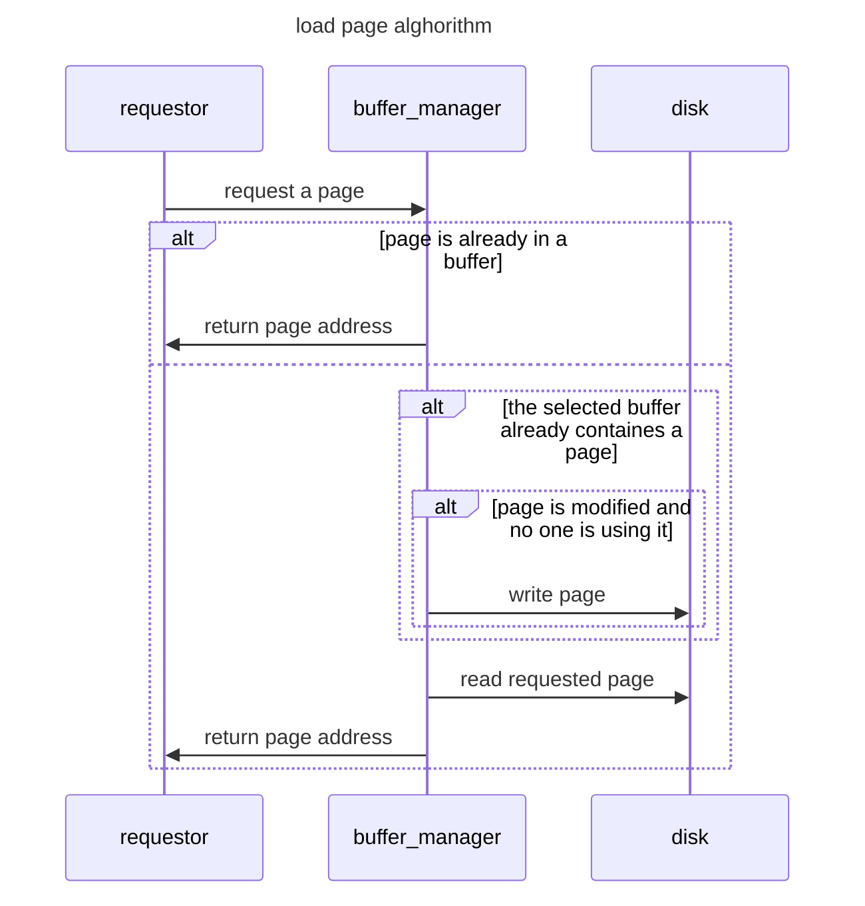

# Gestione del disco da parte di un DBMS

Una parte fondamentale di un DBMS per ottimizzare le performance e la gestione del disco

## Come e fatto un disco?

E importante sapere come i dischi sono strutturati internamente per comprendere il perche dei suoi tempi di accesso. Un disco e composto da un mandrino che fa ruotare dischi, che vengono letti dalle testine poste su un braccio 

> un giradischi evoluto insomma

per calcolare il transfer rate è sufficiente conoscere rpm numero di blocchi per settore e numero di byte per blocco

## Accesso alle tuple: pages

Per ottimizzare l'accesso **le tuple sono caricate in blocchi**  (*dette page*) che nel disco vengono scritte in un blocco continuo di settori del disco, sono le unita di trasferimento atomiche per un DBMS

Le pages hanno una dimensione variabile ($4,64KB$)

>[!NOTE] pagine piu piccole potrebbero richiedere piu operazioni di IO mentre pagine grandi richiedono piu memoria e potrebbero creare problemi di frammentazione

La velocità di trasferimento di una pagina dipende dalla sua dimensione $P$ e dal ratio di trasferimento $T_r$

$$
V_t = \frac{P}{T_r}
$$

## Cosa manipola il livello fisico

Dal punto di vista del livello fisico il DB consiste in una collezione di files, dove un file e una collezione di page

>[!NOTE] in questo caso il termine files non corrisponde a quello usato in sistemi operativi, la gestione di queste strutture e completamente delegata al database che può adottare soluzioni estremamente flessibili e complesse

### Caso studio: DB2

DB2 organizza lo spazio fisico in **tablespace**, ognuno di essi composto da containers, un tablespace contiene in genere una relazione ma può contenerne di più mentre i container possono essere files, devices  oppure directory

In particolare un singolo container e suddiviso in extents che sono blocchi di pagine di dimensione $4KB$, la dimensione di un extent e determinata dal tablespace di riferimento e un extent contiene dati di una singola relazione

## Tablespaces

Esistono 3 principali tipologie di tablespace

| TIPOLOGIA | CARATTERISTICHE                            |
| --------- | ------------------------------------------ |
| **SMS**   | lo storage e gestito dal sistema operativo |
| **DMS**   | lo storage e gestito dall'utente           |
| **AS**    | lo storage e gestito dal dbms              |

>[!TIP] per una gestione avanzata del disco le modalita AS e DMS sono preferibili in quanto viene effettuato un balancing automatico dei containers

Durante la creazione di un tablespace e possibile settare dei parametri

| **PARAMETER**    | **DESCRIPTION**                                            |
| ---------------- | ---------------------------------------------------------- |
| **EXTENTSIZE**   | numero di extent                                           |
| **BUFFERPOOL**   | buffer associato al tablespace                             |
| **PREFETCHSIZE** | numero di pagine da trasferire prima che vengano richieste |
| **OVERHEAD**     | tempo stimato medio di latenza per un operazione di I/O    |
| **TRANSFERRATE** | tempo stimato di trasferimento di una singola pagina       |
>[!NOTE] gli ultimi due vengono utilizzati dal ottimizzatore

## Perché non viene utilizzato il filesystem

Sarebbe opportuno chiedersi perché non vengono utilizzate le funzionalità di accesso al disco offerte dal filesystem, la risposta e semplice:

**le performance di un DBMS sono strettamente legate a come i dati sono organizzati su disco**

Che significa sapere a come i dati devono essere processati logicamente e quali sono le relazioni logiche fra i dati

>[!ERROR] Il filesystem e all'oscuro di queste informazioni!

Per esempio date due relazioni correlate fra di loro (*e.g. join*) può essere una buona idea conservarle in settori consecutivi del disco per accedere con rapidità in caso di dati condivisi dal disco

## Rappresentare valori nel disco

Il database associa delle strategie di rappresentazione per ogni tipologia di dati concessi a livello logico

| **DATATYPE**                              | **REPRESENTATION**                                                                   |
| ----------------------------------------- | ------------------------------------------------------------------------------------ |
| fixed-length strings char($n$)            | si usano $n$ byte con un carattere terminatore                                       |
| variable-length string chars varchar($n$) | si usano $m+p$ bytes dove $m<n$ e i $p$ byte iniziali indicano quanto e lunga la stringa |
| DATE e TIME                        | rappresentati come stringhe di lunghezza fissa|
| Enumerated Types                        | si utilizza un encoding in interi|

### Gestire i campi a lunghezza variabile

I campi a lunghezza variabile risultano un problema in fase di aggiornamento in quanto possono variare il loro spazio di occupazione del disco

Una soluzione comune e quella di scrivere i campi a lunghezza fissa prima dei campi a lunghezza variabile e salvare un puntatore al primo byte di ogni campo a lunghezza variabile

In generale ogni record contiene un header che contiene le seguenti informazioni

- id del record 
- id della relazione del record (utile per l'accesso)
- timestamp della creazione o dell'ultima modifica

### Organizzazione dei record nelle pagine

Il caso comune prevede che la dimensione del record sia di granlunga inferiore a quella della pagina, nel caso di record a lunghezza fissa la struttura di una pagina si presenta come segue

dove l'**header della pagina** contiene
- id della pagina (univoco nel DB)
- id della relazione dei record nella pagina
- timestamp di ultima modifica

>[!NOTE] normalmente i record sono contenuti completamente nella pagina (*no overflow*) e parte dello spazio può essere sprecato

Tuttavia questa organizzazione spreca troppo spazio e incrementa troppo il tempo di accesso, normalmente il formato di una pagina e il seguente:

>[!TIP] in questo modo e possibile riallocare i record all'interno della pagina senza cambiare il RID

Dove nella directory e contenuto un riferimento al primo bite per ogni record, in questo modo il RID può essere composto da PID (*page identifier*) e Slot (*indice nella directory*)

### Cosa fare in caso di page overflow

Se un record eccede la dimensione della pagina esso viene spostato in un altra pagina ma il RID non viene modificato, viene invece introdotto un livello di indirezione per mezzo dei riferimenti delle directory che peggiora le prestazioni

## Lettura e scrittura delle pagine

Leggere una tupla significa spostare la pagina corrispondente dal disco nella memoria centrale in una struttura denominata buffer pool.La gestione del Buffer pool e fondamentale per le performance del DBMS, tale compito e affidato al **BUFFER MANAGER**

L'interfaccia offerta dal buffer manager agli altri componenti del DBMS e la seguente

- `getAndPinPage()` richiede una pagina e la pinna come utilizzata
- `unPinPage()`  rimuove il pin dalla pagina
- `setDirty()` imposta la pagina come modificata
- `fushPage()` scrive la pagina e rimuove il dirty flag

### Come scegliere quale pagina rimpiazzare

I sistemi operativi utilizzano la politica del LRU (last recently used) che per i DBMS non e una scelta valida in quanto il pattern di accesso ai dati di una query e noto (un altro motivo per [non far manipolare il disco al filesystem](#Perché%20non%20viene%20utilizzato%20il%20fylesystem))

## Organizzazione dei file

E importante che i dati siano organizzati in maniera efficiente anche a livello di file

esistono due principali tipologie di file

### Heap file

Le pagine sono disposte in maniera sequenziale all'interno del file.

Uno dei problemi principali di questa modalità e identificare dove e locato lo spazio libero rapidamente per l'inserimento di un nuovo record, per questo 2 approcci sono i più utilizzati

| DOPPIA LISTA LINKATA                                                                            | DIRECTORY PAGE                                                                                                     |
| ----------------------------------------------------------------------------------------------- | ------------------------------------------------------------------------------------------------------------------ |
| si mantengono 2 liste linkate, una per le pagine piene e una per quelle con dello spazio libero | mantenere una pagina directory che tiene traccia dello spazio libero per ogni pagina (*soluzione adottata da DB2*) |
>[!NOTE] la prima soluzione presenta il problema che quasi tutte le pagine avranno dello spazio libero e una scansione della lista potrebbe essere richiesta sempre

### Sequential file

In questa tipologia di file i record sono ordinati in base a un dato attributo

>[!NOTE] vien da se che l'inserimento di un record dovra preservare l'ordine

### Heap vs Sequential

| OPERATION     | HEAP COST                          | SEQUENTIAL COST                            |
| ------------- | ---------------------------------- | ------------------------------------------ |
| search by key | $NP/2$ in media $NP$ al massimo | $\log_2{NP}$                               |
| range search  | $NP$                               | $costofsearch -1 + \frac{(H-L)*NP}{HK-LK}$ |
|               | $2$                                | $costofsearch +1$                          |
| deletion      | $cost of search +1$                | $costofsearch +1$                          |
| update        | $cost of search + 1$               | $costofsearch +1$                          |

[PREVIOUS](pages/struttura_database.md) [NEXT](pages/indici.md)
