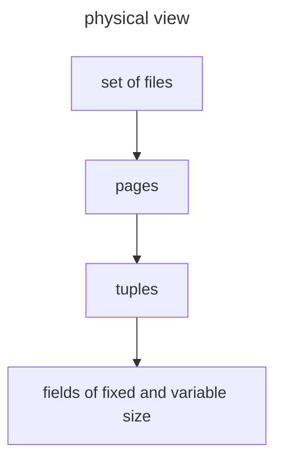

# Gestione del disco da parte di un DBMS

Una parte fondamentale di un DBMS per ottimizzare le performance e la gestione del disco

>[!TODO] come e strutturato il disco

## Accesso alle tuple: pages

Per ottimizzare l'accesso **le tuple sono caricate in blocchi**  (*dette page*) che nel disco vengono scritte in un blocco continuo di settori del disco, sono le unita di trasferimento atomiche per un DBMS

Le pages hanno una dimensione variabile ($4,64KB$)  

>[!NOTE] pagine piu piccole potrebbero richiedere piu operazioni di IO mentre pagine grandi richiedono piu memoria e potrebbero creare problemi di frammentazione

La velocità di trasferimento di una pagina dipende dalla sua dimensione $P$ e dal ratio di trasferimento $T_r$ 

$$
V_t = \frac{P}{T_r}
$$

## Cosa manipola il livello fisico

Dal punto di vista del livello fisico il DB consiste in una collezione di files, dove un file e una collezione di page

>[!NOTE] in questo caso il termine files non corrisponde a quello usato in sistemi operativi, la gestione di queste strutture e completamente delegata al database che può adottare soluzioni estremamente flessibili e complesse

### Caso studio: DB2

DB2 organizza lo spazio fisico in **tablespace**, ognuno di essi composto da containers, un tablespace contiene in genere una relazione ma può contenerne di più mentre i container possono essere files, devices  oppure directory

In particolare un singolo container e suddiviso in extents che sono blocchi di pagine di dimensione $4KB$, la dimensione di un extent e determinata dal tablespace di riferimento e un extent contiene dati di una singola relazione

## Tablespaces

Esistono 3 principali tipologie di tablespace

| TIPOLOGIA | CARATTERISTICHE                            |
| --------- | ------------------------------------------ |
| **SMS**   | lo storage e gestito dal sistema operativo |
| **DMS**   | lo storage e gestito dall'utente           |
| **AS**    | lo storage e gestito dal dbms              |

>[!TIP] per una gestione avanzata del disco le modalita AS e DMS sono preferibili in quanto viene effettuato un balancing automatico dei containers

Durante la creazione di un tablespace e possibile settare dei parametri

| **PARAMETER**    | **DESCRIPTION**                                            |     |
| ---------------- | ---------------------------------------------------------- | --- |
| **EXTENTSIZE**   | numero di extent                                           |     |
| **BUFFERPOOL**   | buffer associato al tablespace                             |     |
| **PREFETCHSIZE** | numero di pagine da trasferire prima che vengano richieste |     |
| **OVERHEAD**     | tempo stimato medio di latenza per un operazione di I/O    |     |
| **TRANSFERRATE** | tempo stimato di trasferimento di una singola pagina       |     |
>[!NOTE] gli ultimi due vengono utilizzati dal ottimizzatore

## Perché non viene utilizzato il fylesystem

Sarebbe opportuno chiedersi perché non vengono utilizzate le funzionalità di accesso al disco offerte dal filesystem, la risposta e semplice:

**le performance di un dbms sono strettamente legate a come i dati sono organizzati su disco**

Che significa sapere a come i dati devono essere processati logicamente e quali sono le relazioni logiche fra i dati

>[!ERROR] Il filesystem e all'oscuro di queste informazioni!

Per esempio date due relazioni correlate fra di loro (*e.g. join*) può essere una buona idea conservarle in settori consecutivi del disco per accedere con rapidità in caso di dati condivisi dal disco

## Rappresentare valori nel disco

Il database associa delle strategie di rappresentazione per ogni tipologia di dati concessi a livello logico

| **DATATYPE**                              | **REPRESENTATION**                                                                   |
| ----------------------------------------- | ------------------------------------------------------------------------------------ |
| fixed-length strings char($n$)            | si usano $n$ byte con un carattere terminatore                                       |
| variable-length string chars varchar($n$) | si usano $m+p$ bytes dove $m<n$ e i $p$ byte iniziali indicano quanto e lunga la stringa |
| DATE e TIME                        | rappresentati come stringhe di lunghezza fissa|
| Enumerated Types                        | si utilizza un encoding in interi|

### Gestire i campi a lunghezza variabile

I campi a lunghezza variabile risultano un problema in fase di aggiornamento in quanto possono variare il loro spazio di occupazione del disco

Una soluzione comune e quella di scrivere i campi a lunghezza fissa prima dei campi a lunghezza variabile e salvare un puntatore al primo byte di ogni campo a lunghezza variabile

In generale ogni record contiene un header che contiene le seguenti informazioni