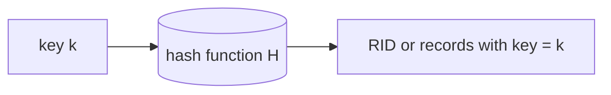
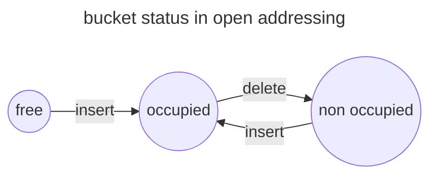
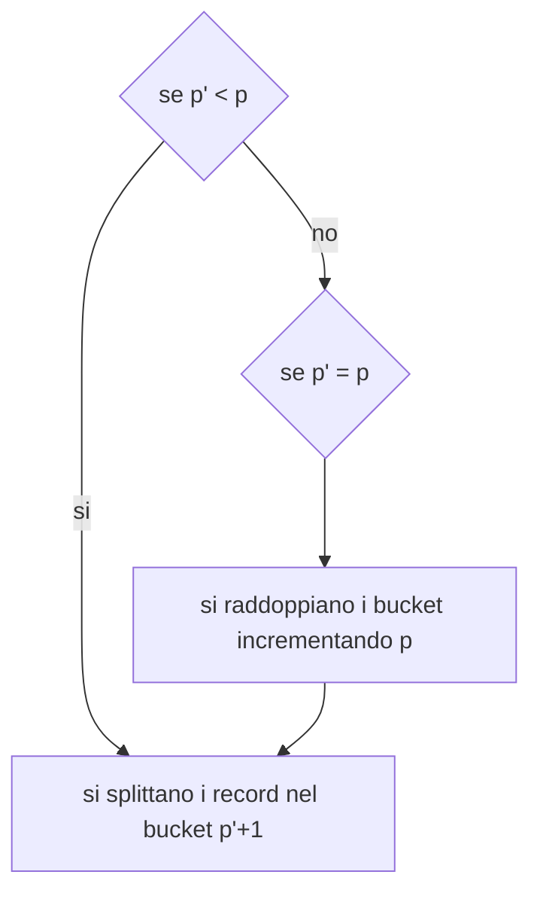
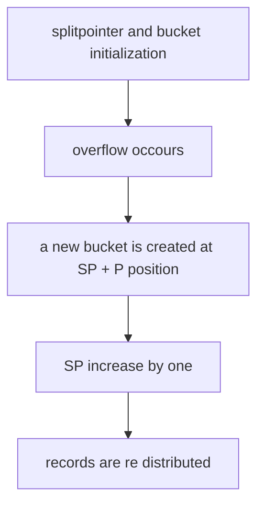

# Indici hash

a differenza degli [Indici ordinati](indici.md#Indici%20ordinati) gli indici hash non mantengono l'associazione `key -> RID` in maniera esplicita ma sfruttano una funzione hash

Le funzioni **hash non sono iniettive** quindi sono possibili collisioni fra le chiavi,

ogni possibile valore generabile dalla funzione hash definisce uno spazio logico detto **bucket**, mentre il numero di elementi che il bucket può contenere e detto **capacita**, la memoria composta dai bucket e detta **primary area**

## Bucket overflow

Come già detto i bucket hanno una capacita, se l'inserimento di un record avviene all'interno di un bucket pieno si ha un caso di **bucket overflow**, questo e uno dei problemi principali da gestire in caso di utilizzo di indice hash.

Gli indici hash sono classificati secondo la metodologia di gestione della memoria

| STATIC INDICES                                             | DYNAMIC INDICES                                                                             |
| ---------------------------------------------------------- | ------------------------------------------------------------------------------------------- |
| Il numero $P$ di bucket generati dalla funzione e costante | La dimensione dell'area primaria si adatta all'effettiva dimensione dei dati da indicizzare |

## Cosa controllare in un indice hash

Per tutti gli indici hash le seguenti considerazioni sono fondamentali:

- scelta della funzione hash
- Gestione del [Bucket overflow](#Bucket%20overflow)
- Capacita $C$ dei bucket della primary area
- Capacita $C_{OV}$ dei bucket dell' area di overflow (*se presente*)
- Utilizzo della memoria allocata

## Funzioni hash

Alcune delle funzioni hash più utilizzate sono:

- **mid square** viene calcolato il quadrato ed estratte le prime $P-1$ cifre e il risultato normalizzato per $P$
- **shifting** la chiave e spezzata in parti di lunghezza uguale a quella del numero $P-1$, le stringhe sono sommate e normalizzate per $P$
- **folding**  simile allo shifting ma le stringhe sono ribaltate prima di essere sommate
- **division** la chiave viene divisa per un valore $Q$

## Gestire chiavi alfanumeriche

Per le chiavi alfanumeriche e necessaria una conversione in valori numerici per mezzo di una funzione biettiva $ord()$ e poi applicare la funzione di hash

$$
k(S) = \sum_{i=0}^{n-1}ord(s_i)\times b^i
$$
>$b$ e un coefficiente per evitare problemi con stringhe anagrammi

## Valutare una hash function: Degeneracy

Un criterio per valutare le funzioni hash e l'analisi del parametro di degeneracy:

$$
degeneracy = \sigma/\sqrt{\mu} \space con
$$
$$
\mu = \sum_{j=0}^{P-1}{\frac{X_j}{P}} \space \sigma^2 = \sum_{j=0}^{P-1}{\frac{(X_j-\mu)^2}{P}}
$$
> [!TIP] minore il parametro migliori le performance della funzione hash

## Dimensionare l'indice hash: Load factor

Data una stima $N$ dei record e una capacita $C$ dei bucket, determinare il parametro **load factor** $d$ definisce il numero di bucket $P$ come 

$$
P = \frac{N}{d*C}
$$ 
>[!TIP] un valore alto di $d$ riduce il numero di record nell'area di overflow

## Gestire l'overflow

Per gestire l'overflow ci sono diverse tecniche: le principali sono

- **chaining** vengono usati puntatori e overflow area
- **open addressing** vengono usati i bucket nell'area primaria per gestire gli overflow (*no puntatori*)

### Chaining

Due principali strategie di chaining sono:

- **separate lists** i record in overflow vengono inseriti nel primo bucket successivo libero i record sono mantenuti linkati fra loro
- **coalesced chaining** i bucket sono linkati fra loro (*non i record*), meno efficiente ma semplifica la gestione dei bucket

### Open addressing

Nel caso di tecniche di open addressing per ogni valore della chiave $k_i$ si predispone una sequenza di possibili indirizzamenti $H_0(k_i)....H_l(k_i)$ in fase di inserimento si testano tutti gli indirizzamenti fino a trovare un bucket non pieno

Nel caso di una ricerca nell'indice e necessario cercare $k_i$ in tutti i bucket $H_0(k_i)....H_l(k_i)$, inoltre l'operazione di eliminazione di un record deve essere effettuata con cautela in quanto trasforma un bucket pieno in un bucket non pieno che può arrestare la ricerca in fase di inserimento

Possibili tecniche di open addressing sono

- **linear probing** ad ogni step viene aggiunto un valore costante $s$ $H_j(k_i) = (H(k_i) +s \times j)\% P$
- **quadratic probing** come il linear probing ma l'incremento e lineare $a + b(2j +1)$ 
- **double hashing** vengono usate due funzioni hash per generare l'indirizzamento $H_j(k_i) = (h_{j-1} + H^{''}(k_i))\%P \space per \space j \gt 0$ e $H_0(k_i) =H^{'}(k_i)$ 

>[!WARNING] la tecnica di double hashing ha un side effect in memoria secondaria dovuto all'alta variabilità degli indirizzamenti generati, pagine conseguenti sono disposte in settori non consecutivi del disco, aumentando la latenza

## Problematiche degli indici statici

Per poter utilizzare gli indici statici lo storage deve essere allocato durante il design iniziale, questo porta a una sovra/sotto stima dello storage che risulta problematica da risolvere a database in produzione, le strategie di hashing dinamico puntano a risolvere a priori questo problema

Le strategie di hashing dinamico si categorizzano in base all'utilizzo o meno della **directory**

| STRATEGIE CON DIRECTORY | STRATEGIE SENZA DIRECTORY |
| ----------------------- | ------------------------- |
| Virtual hashing         | Linear hashing            |
| Dynamic hashing         | Spiral hashing            |
| Extendible hashing      |                           |

### Virtual hashing

Al verificarsi di un overflow l'area primaria viene raddoppiata e il record viene inserito nel bucket *buddy*

E necessaria una struttura di supporto **directory** per comprendere quale funzione di hash deve essere utilizzata per recuperare un record, un vettore $V$ binario viene utilizzato per tenere traccia dello stato dei bucket

### Dynamic hashing

La strategia punta a evitare il raddoppio dell'area primaria usando una **struttura directory ausiliaria ad albero binario**.

La funzione hash in questo caso da in output una pseudo chiave binaria $H(k)= b_0,b_1,b_2,...$ usata per navigare la directory

L'overflow viene gestito aggiungendo un solo bucket all'area primaria e ridistribuendo le chiavi tra i nodi della directory

### Extendible hashing

Simile al [Dynamic hashing](#Dynamic%20hashing) ma la directory e composta da $2^p$ celle che contengono un puntatore a un bucket, la funzione di hash produce uno pseudo address di cui vengono utilizzati solo i primi $p$ bits per accedere direttamente la directory

Ogni bucket ha un valore di local depth $p^{'}$  utilizzato per segnalare il numero di bit utilizzati per allocare chiavi nel bucket

In caso di overflow si procede come segue

In caso di eliminazione i bucket possono essere uniti se il numero di record del bucket e del buddy sono inferiori alla capacita $C$

### Linear hashing

Nell'approccio a linear hashing il bucket che viene diviso non e quello in overflow ma un altro scelto in base a un dato criterio

Uno dei principali contro di questa strategia e che all'aumentare di SP gli split sono sempre più costosi

### Recursive Linear hashing

In questa modalità l'area di overflow viene gestita per mezzo del [Linear hashing](#Linear%20hashing), vengono creati multipli livelli di overflow dove il livello $h$ salva i suoi record in overflow nel livello $h+1$

### Spiral hashing

Uno dei problemi del [Linear hashing](#Linear%20hashing) risiede nel fatto che la probabilità che dei bucket che non hanno subito uno split nella espansione corrente e' alta.

L'idea alla base dello spiral hashing punta a concentrare i record nella prima sezione della primary area sfruttando una funzione esponenziale

[PREVIOUS](pages/GiST.md) [NEXT](pages/transazioni.md)
