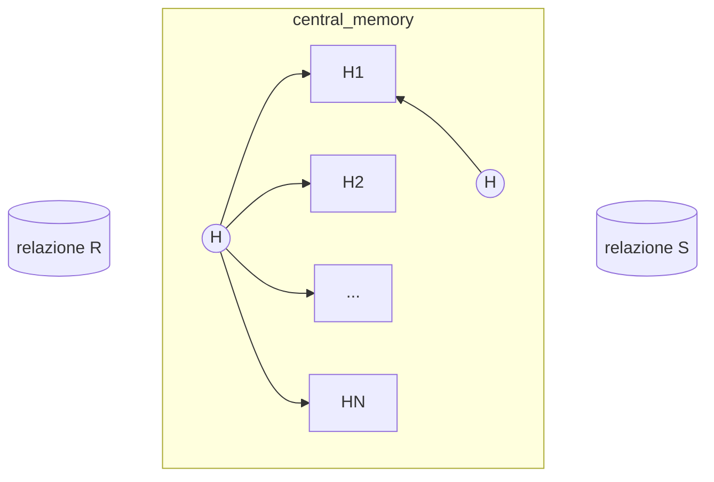
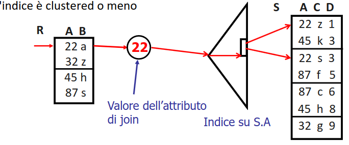

# Join

Uno degli operatori fondamentali, data la query che segue

```sql
SELECT *
FROM Recensioni R, Sommelier S
WHERE R.sid=S.sid
```

Determinare la maniera più efficiente per rispondere non e banale in quanto l'operatore di join comporta potenzialmente un alto costo di esecuzione, negli anni sono state pensate diverse soluzioni la cui efficienza dipende una combinazione di diversi fattori tra cui:

- indici utilizzabili
- ordinamento dei dati
- quantità di buffers
- possibilità di restituire i risultati
> lasciamo perdere l'opzione di fare il prodotto cartesiano e applicare una [selezione](selezione.md).....

## Nested loop join

La soluzione più semplice prevede il confronto fra i record delle due relazioni $R,S$

```python
for r in R:
	for s in S:
		if joinPred(r,s):
			# add to result
```

Il costo e tuttavia esorbitante in quanto si ha 

$$
P(R) + TP(R)\times P(R)\times P(S)
$$

>[!NOTE] è conveniente avere come relazione esterna quella con più tuple ma il guadagno sulle prestazioni non è significativo

>[!TIP] il nested loop join conserva l'ordine della relazione esterna, ottimo per query che chiedono di essere ordinate

## Paged nested loop join

Questa versione rinuncia alla proprietà di ordinamento per guadagnare in numero di operazioni di I/O

```python
for Rpage in R:
	for Spage in S:
		for r, s in Rpage,Spage:
			if joinPred(r,s):
				# add to result
```

## Sfruttando i buffer, Block nested loops join

Gli algoritmi sopracitati non tengono in conto la dimensione del buffer, in caso di $B$ pagine di buffer si possono utilizzare $B-2$ pagine per la relazione esterna $1$ per la relazione interna e $1$ per l'output

>[!TIP] ci può essere un caso in cui la relazione interna a il maggior numero di buffer ovvero quando si **può contenere interamente in memoria**

### Matching nel block nested loop join

Per effettuare il matching nel [block nested loop join](#Sfruttando%20i%20buffer,%20Block%20nested%20loops%20join) si può sfruttare una funzione di hash per allocare i record della relazione $R$, le pagine di $S$ vengono lette sequenzialmente e le tuple sottoposte alla stessa  funzione di hash per trovare il match



## Sfruttando gli indici: index nested loop join

e possibile utilizzare un indice per accedere alla relazione interna, il costo dipende dal tipo di indice (*[b+tree](b+tree.md) oppure [indici_hash](indici_hash.md)*) e da se l'indice e clustered o meno



>[!TIP]  si possono sfruttare operazioni di push down delle selezioni per alleggerire l'esecuzione di query di ricerca
```sql
SELECT * FROM SOMELIER S RECENSIONI R
WHERE R.SID=S.SID
AND R.RIVISTA= "sapore di vino"
```

## Merge-scan join

si basa sul fatto che entrambe le relazioni siano **ordinati sull'attributo di join** (*in caso non sia vero e necessario ordinarle*). Le due relazioni vengono scandite e accoppiate secondo la chiave di join 


```python
result=[]
while !F.empty() and G.empty():

    if f.A > g.B
        g = G.next()

    else if f.A < g.B
        f = F.next()

	# after first match find all values with matches
    else
		result.append(f)
		f_1 = F.next()
        while ! F.empty() and f_1.A = g.B:
			result.append(f)
			f_1 = F.next()
      
        g_1 = G.next()
        while ! G.empty() and g_1.B = f.A
			result.append(g)
	        g_1 = G.next()

        f = F.next()
        g = G.next()
```

Il costo  e la somma del numero di pagine di entrambe le relazioni $P(R)+P(S)$

>[!TIP] Se si ha un indice sugli attributi di join non e necessario ordinare le relazioni, se unclustered il costo e comunque elevato

## Hash join

il vantaggio del [Merge-scan join](#Merge-scan%20join) è che viene ridotto il numero di confronti fra i record delle relazioni, lo stesso obbiettivo si può ottenere con una funzione di hash sui valor degli attributi di join, la strategia e quella vista per la [proiezione fatta con hashing](proiezione.md#Proiettare%20usando%20hashing), mentre la fase di matching può essere realizzata per mezzo del [block nested loop join](#Matching%20nel%20block%20nested%20loop%20join)

>[!WARNING] sia hash join che merge scan join sono utilizzabili solo per equi join

## Outer join

In caso di outer left/right join:

```sql
SELECT
FROM D.*, E.* Department D LEFT JOIN Employee E
ON (E.WorkDept = D.DeptNo)
```

Gli algoritmi precedenti si modificano come segue

- [Nested loop join](#Nested%20loop%20join): si usa $D$ come relazione esterna e si aggiunge all'output ogni tupla di $D$ che non trova match in $E$
- [Merge-scan join](#Merge-scan%20join): si usa $D$ come relazione esterna e, quando non si trova un match per una tupla di $D$, la si aggiunge al risultato
- [Hash join](#Hash%20join): si usa come relazione esterna $E$. Dopo aver partizionato $E$ e $D$, per ogni partizione di $E$ si costruisce una hash table e si fa il probing per tutti i record di $D$ nella partizione omologa. Se il probing non trova match si aggiunge il record di $D$ all'output

In caso di full join:

- [Nested loop join](#Nested%20loop%20join): non è applicabile
- [Merge-scan join](#Merge-scan%20join): aggiunge le tuple dangling di entrambi gli input
- [Hash join](#Hash%20join): per aggiungere anche le tuple dangling della relazione esterna, quando si costruisce la hash table si aggiunge un flag per tener traccia di quali tuple hanno trovato un match. Al termine si fa un passo finale sulla hash table per collezionare tutte le tuple dangling

[PREVIOUS](pages/proiezione.md) [NEXT](pages/group_by.md)
