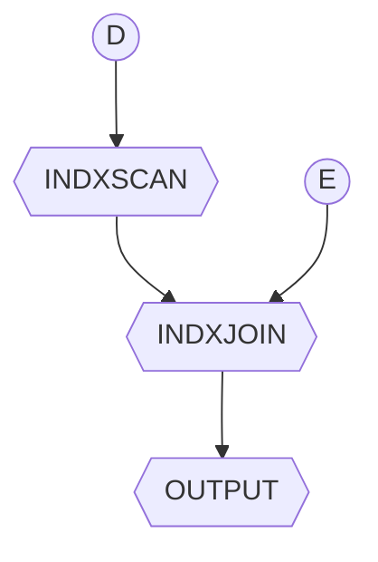

# progetto fisico e tuning del DB

La valutazione del progetto fisico di  un db avviene tramite la misura delle prestazioni del db alle query più frequenti richieste dall'applicazione. Le  prestazioni possono essere migliorate

- in fase di progettazione (*logica e fisica*)
- in produzione tramite tuning dei parametri del db

## Tuning e principali problematiche

Alcune delle problematiche principali affrontate sono:

- **Selezione degli indici** Su quali attributi conviene costruire un indice? 
>[!NOTE] Un indice può velocizzare alcune query, ma tipicamente rallenta le transazioni
- **Data clustering**Conviene mantenere i dati ordinati? Su quale attributo?
- **Data partitioning** Conviene partizionare i dati? 
>[!TIP] Fondamentale in ambito distribuito, ma importante anche in DBMS centralizzati
- **Modifiche dello schema logico** per migliorare le prestazioni (*Denormalizzazione, replicazione*)
- **Riscrittura di query/transazioni** SQL server-side (*trigger, stored procedures*)

## Workload

Per effettuare un tuning efficace e fondamentale avere informazioni sull'utilizzo dei dati, in particolare
- Un **elenco di query con la rispettiva frequenza di esecuzione**
- Un **elenco di transazioni** (*operazioni di modifica*) con la rispettiva **frequenza di esecuzione**
- Un **obiettivo di prestazioni** per ciascun tipo di query/operazione di modifica

## Selezione degli indici

Il problema della selezione degli indici può essere modellato con un **problema di ottimizzazione**, dato che lo spazio delle possibili soluzioni dato un [Workload](#Workload) e enorme, le best practices sono le seguenti:

- considerare prima gli indici che possono migliorare le **query più importanti** e poi gli indici più marginali
- Non creare indici inutili (*che non vengono utilizzati da query del workload*)
- Creare prima indici che velocizzino più di una query
- Considerare l'impatto dei costi di modifica, quindi attenzione a creare indici su attributi soggetti spesso ad aggiornamenti!

### Esempio, query con join e selezione

```sql
SELECT E.name, D.mgr
FROM Employees E, Departments D
WHERE E.dno = D.dno
AND D.name = 'Toy'
```

In questo caso un piano di accesso ragionevole potrebbe essere questo:



In questo caso sono necessari un indice su `D.name` e un indice su `E.dno` (*possibilmente [hash](indici_hash.md)*)

### Esempio: join con filtro su due relazioni

```sql
SELECT E.name, D.mgr
FROM Employees E, Departments D
WHERE E.dno = D.dno
AND D.name = 'Toy'
AND E.age = 25
```

In questo caso se si possiede un indice su `E.age` potrebbe non essere necessario l'indice per fare [index nested loop join](join.md#Sfruttando%20gli%20indici%20index%20nested%20loop%20join), dipende da quanto e selettivo

### Esempio: indici per query range

```sql
SELECT E.eid
FROM Employees E
WHERE E.age BETWEEN 20 AND 30
AND E.sal BETWEEN 3000 AND 5000

SELECT E.eid
FROM Employees E
WHERE E.sal BETWEEN 3000 AND 5000
AND E.age = 25
```

Nel primo caso un indice ([b+tree](b+tree.md)) su `age,sal` può risultare conveniente, nel secondo caso l'ordine degli attributi nella query e più rilevante, in particolare:

- `age,sal` entrambi i predicati sono range delimiting
- `sal,age` il predicato su age e index-sargable 

## Data clustering

Come mostrato in precedenza DB2 contempla la presenza [di indici non perfettamente clustered](operatori_modifica.md#Update%20della%20clustering%20key), di conseguenza e necessario che attributi scegliere per un indice clustered e determinare il livello di clustering desiderato

>[!TIP] Le query di range sono quelle che **beneficiano maggiormente dalla clusterizzazione di un indice**, insieme alle ricerche `=`  su attributi non chiave traggono vantaggio da indici clustered in caso di molti duplicati

>[!NOTE] I piani di accesso index-only non necessitano di indici clustered

### Collezione di statistiche su DB2

Le informazioni statistiche su tabelle e indici sono fondamentali per permettere all'ottimizzatore di operare scelte accurate e per poter ragionare in fase di tuning

In DB2 si usa il **comando `RUNSTATS`**

```sql
RUNSTATS ON TABLE MySchema.TableName 
WITH DISTRIBUTION ON ALL COLUMNS 
AND DETAILED INDEXES ALL
```

La forma `WITH DISTRIBUTION` indica di collezionare statistiche dettagliate sulle distribuzioni dei valori (*istogrammi e valori frequenti*) delle varie colonne.
La forma `DETAILED INDEXES ALL` genera informazioni utili per capire lo "stato di salute" di un indice e il costo di un index scan

## Partizionamento dei dati

Il partizionamento dei dati viene svolto per diverse motivazioni tra cui suddividere il costo computazionale su piu server, escludere parti di table a priori data una query  e ridurre il numero di transazioni in conflitto


Le strategie di partizionamento si dividono in due categorie

### Partizionamento verticale

E' il caso in cui gli attributi di una relazione vengono ripartiti su 2 o più table, mantenendo su ognuna la primary key

### Partizionamento orizzontale

In una relazione partizionata orizzontalmente sono le **tuple che vengono fisicamente ripartite in 2 o più table** e la relazione originale si ottiene facendo la UNION delle diverse table

Le tipologie di partizionamento orizzontale sono 2:

- **Hash partitioning** si sfrutta una funzione hash su una chiave per suddividere le tuple nelle varie tabelle
- **Range partitioning** si partiziona in base a intervalli di valori di un particolare attributo con l'obbiettivo di mettere insieme tuple con lo stesso valore di attributo

## Partizionamento degli indici

in caso di table partizionate si può partizionare anche gli indici

- se l'indice è dichiarato UNIQUE, allora la chiave dell'indice **deve includere la partitioning key** per poter essere partizionato(*vincolo di DB2*)

>[!NOTE] questo per evitare in fase di update di dover scandire tutte le partizioni

## Transazioni e SQL server-side

Un aspetto fondamentale per il tuning e la gestione delle transazioni in particolare

- **Livello di concorrenza**: optare per un livello di isolation il più basso possibile, al fine di ridurre le probabilità di conflitti
- **Transazioni complesse**: compatibilmente con i vincoli che l'applicazione impone, cercare di evitare transazioni che includono molte istruzioni SQL, in particolare se queste sono inframezzate da input dall'utente
- **SQL server-side**: Spostare lato server quante più operazioni possibili, al fine di ridurre il flusso di comunicazione client-server

a tal fine possono essere impiegati trigger o stored procedures

[PREVIOUS](pages/ricerca_piano_accesso.md) [NEXT](pages/indici_multidimensionali.md)
