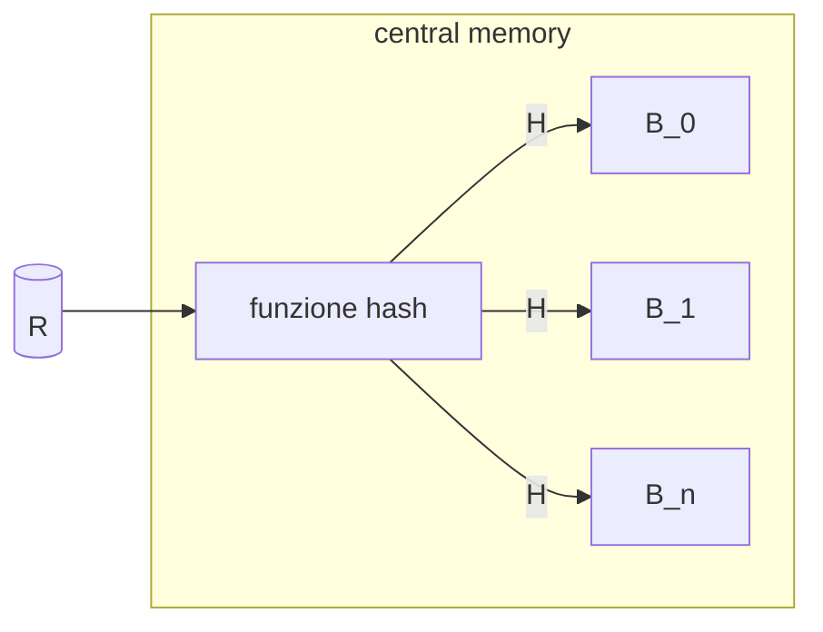

## Ricerca del piano di accesso ottimale

La ricerca del miglior piano di accesso avviene enumerando i possibili piani di accesso in un opportuno **spazio di ricerca**

Per ogni piano di accesso e necessario **stimarne il costo** e di conseguenza la cardinalità dei risultati parziali

## Database profile

Uno degli approcci più diffusi per stimare la cardinalità di un dato operatore su una relazione e quello di tenere informazioni statistiche sulle relazioni all'interno dei cataloghi, per esempio DB2 mantiene le seguenti informazioni

- `FPAGES` pagine usate dalla table ($P$)
- `NPAGES` pagine contenenti record ($\leq P$)
- `CARD` record di una table ($N$)

Per gli attributi:

- `COLCARD` numero valori distinti per attributo ($NK$)
- `HIGH2KEY` secondo valore maggiore
- `LOW2KEY` secondo valore minore

## Determinare la selettività di un predicato

Come visto prima e fondamentale determinare la [selettività](selezione.md#Stimare%20il%20numero%20di%20risultati) di un predicato per stimarne i record in output, **assumendo una distribuzione uniforme dei valori degli attributi**

| predicato                                           | Fattore di selettivita                  |
| --------------------------------------------------- | --------------------------------------- |
| $A = v$                                             | $f = 1/NK(A)$                           |
| $A \space in \space (v_1,...,v_n)$                  | $f = n/NK(A)$                           |
| $A \lt v$                                           | $f = \frac{v - min(A)}{max(A)-min(A)}$  |
| $A \space between \space v_1 \space and \space v_2$ | $f = \frac{v_2 - v_1}{max(A) - min(A)}$ |

## Selettività in caso di più operatori

In caso di combinazione di operatori **se si conoscono le selettività dei singoli operatori** si può stimare la combinazione come 

$$
f = f_1 \times f_2 \times f_3 \times ... \times f_n
$$

>[!WARNING] La cosa e più complessa se si hanno i fattori combinati degli operatori  

## Selettività del [join](join.md)

La selettività del join si stima come $f_j*N(R)*N(S)$, in caso di equi join si assume che tutti i valori dell'attributo di join della relazione con meno valori si mappino in una tupla di output quindi si ha

$$
f_j = \frac{1}{max(NK(R.A),NK(S.B))}
$$

>[!TIP] nel caso di chiave primaria si ha che la cardinalità e pari a $N(S)$ dato che $f_j = \frac{1}{N(R)}$

## Cardinalità della [proiezione](proiezione.md)

- Se si proietta su un attributo solo di $A$ si ha che $E = NK(A)$
- Se si proietta su un attributo chiave o non si hanno informazioni si ha il caso peggiore  $E = N(R)$

## Stimare i valori distinti

Una delle metriche più fondamentali da stimare e il numero di valori distinti di un attributo $NK(A)$, le strategie per la stima sono le seguenti

- collezionare statistiche accurate
> troppo costoso
- campionare i dati
- usare metodi hash con modelli probabilistici (alla [cardenas](b+tree.md#Modello%20di%20cardenas))

### Linear counting

Una delle modalita di stima per mezzo di modelli probabilistici e  quello di predisporre un array di $B$ bit  e una funzione hash a $[0,B-1]$ si scandisce la relazione e si applica la funzione di hash all'attributo in questione



il numero di valori distinti viene quindi stimato come $NK(A) = Bln(B/Z)$

## Superare l'ipotesi della distribuzione uniforme: Istogrammi

Fino ad ora si e dato per ipotesi che i dati di un dato attributo fossero distribuiti in maniera uniforme ma nella realtà questo e un caso molto raro, per superare questa limitazione si fa l'utilizzo di istogrammi


### Istogrammi: Tipologie

Ci sono diverse tipologie di istogrammi

- **equi-width** il dominio e suddiviso in $B$ intervalli della stessa ampiezza facile da aggiornare ma non si hanno garanzie sull'errore della stima
- **equi-depth** i bucket sono divisi in modo che il numero di tuple per intervallo sia simile
- **equi-compressed** estensione degli istogrammi **equi-depth** dove viene mantenuto un contatore a parte per il valore piu frequente (*MVC*)

## Ottimizzare query su una relazione

In caso di query su una singola relazione (*presente una sola tabella nella clausola `FROM`*) e necessario gestire solo selezioni e proiezioni, ci sono 4 casistiche possibili:

- Scansione sequenziale
- Uso di un solo [indici](indici.md) (*eventualmente clustered*)
- Uso di più [indici](indici.md)
- Uso solo di un indice (*non si accede ai dati*)

## Ottimizzare query con più relazioni

In caso di relazioni multiple  e necessario comprendere come ordinare le operazioni di [join](join.md), date le sue proprietà lo spazio di ricerca e **esponenziale nel numero $n$ di relazioni**

date $n$ relazioni il numero di possibili join trees sono dati da

$$
JT_{n+1} = \frac{2n!}{n!}
$$

Se si considerano anche tutte le possibili implementazioni di join si deve aggiungere un fattore $m^n$ 

>[!ERROR] lo spazio di ricerca cresce esponenzialmente

## Programmazione dinamica

La tecnica più utilizzata per ridurre lo spazio di ricerca e basata sul **principio di ottimalita** 

>[!CITE] dati 2 percorsi parziali $P_1$ e $P_2$ che hanno origine in $S$ e arrivano entrambi in un nodo $V$, se $costo(P_1) \lt costo(P_2)$, allora $P_2$ non può essere esteso in modo tale da generare un percorso di costo minimo da $S$ a $T$

Questo permette di ignorare tutti i percorsi figli di uno non ottimale

### Algoritmo DP

L'algoritmo sfrutta il principio di ottimalita per escludere ad ogni passo i piani non ottimali:

- **primo passo**: viene determinato il piano parziale migliore per tutte le relazioni
- **passo $k$-esimo** per ogni sottoinsieme di $k$ relazioni viene determinato il piano migliore a partire dai piani selezionati al passo $k-1$

>[!NOTE] l'output non considera gli operatori di accesso fisico ai dati

### Programmazione dinamica, ridurre lo spazio di ricerca

Lo spazio di ricerca dell'algoritmo e comunque esponenziale in $n$, e dunque necessario adottare euristiche che consentano di ridurre lo spazio di ricerca, le strategie più adottate sono

- escludere i prodotti cartesiani
- considerare solo left-deep join trees


In caso di utilizzo esclusivo dei left-deep join trees lo spazio di ricerca si riduce a 

$$
JTLD\_DP_n = \sum_{k=1}^{n} \binom{n}{k} = n \times 2^{n-1}
$$

### Greedy join enumeration

Per ridurre ulteriormente lo spazio di ricerca si sceglie il join che ha costo minimo (*a parita, quello che produce meno tuple in output*)

### Ordini significativi

Si dice che l'ordine delle tuple di un operatore e significativo se può influenzare le operazioni che restano da compiere per una query

```sql
SELECT S.snome, R.rivista, V.cantina
FROM Recensioni R, Sommelier S, Vini V
WHERE R.vid=V.vid
AND R.sid=S.sid
AND V.vnome='Merlot'
ORDER BY S.snome,V.cantina
```

In questo caso se si sceglie di eseguire il join prima tra $V$ ed $R$ l'ordine significativo sarebbe quello su $sid$, se le tuple fossero ordinate per $snome$ e $cantina$ sarebbe l'ordine più significativo in quanto risolve `ORDER BY`

Se si considerano gli ordini significativi e necessario estendere la definizione precedente come segue

>[!CITE] Un piano di accesso (*parziale*) $AP$ per un sottoinsieme di relazioni $S$, il cui risultato è ordinato secondo un ordine significativo $O$ e il cui costo è maggiore di quello di un piano $AP^{'}$ per le stesse relazioni e con lo stesso ordine (*o più significativo*), non può essere esteso in un piano di accesso a costo minimo

si dice che **$AP^{'}$ domina $AP$**

## Controllo del livello di ottimizzazione

DB2 permette di controllare il livello di ottimizzazione applicato alle query per mezzo del parametro

```sql
SET CURRENT QUERY OPTIMIZATION = n
```

dove $n$ può assumere i seguenti valori:

- $0$ Basic rewrite rules, greedy join enumeration, only nested loops join
- $1$ Frequent values statistics are not used, greedy join enumeration, subset of rewrite rules
- $2$ All statistics are used, almost all rewrite rules are applied, greedy join enumeration
- $3$ DP enumeration (*left-deep & no Cartesian products*), index ANDing
- $5$ (*default*) More complex rewrite rules
- $7$ Similar to 5 but without the heuristic rules
- $9$ A maximal amount of optimization is performed to generate an access plan.

## Gestione del [group by](group_by.md)

Nei DBMS moderni il group by viene gestito al termine dell'esecuzione dei join, tuttavia vi e la possibilità di farne il push down a patto che **i valori delle funzioni aggregate non cambino**

[PREVIOUS](pages/ottimizzazione_interrogazioni.md) [NEXT](pages/progetto_fisico_tuning.md)
