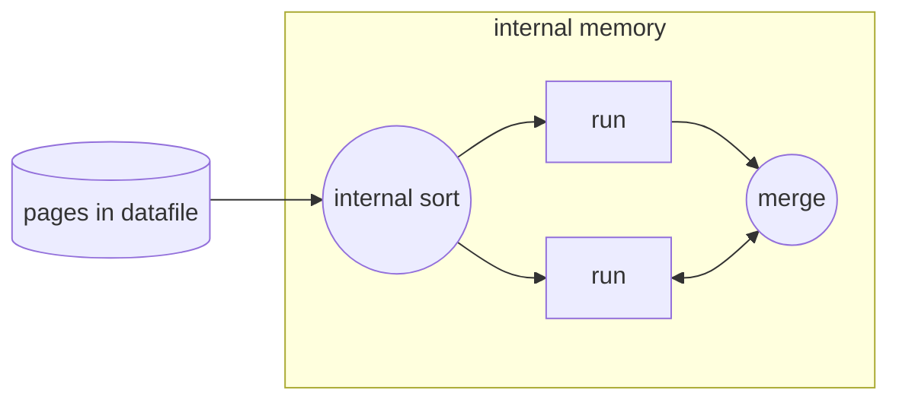
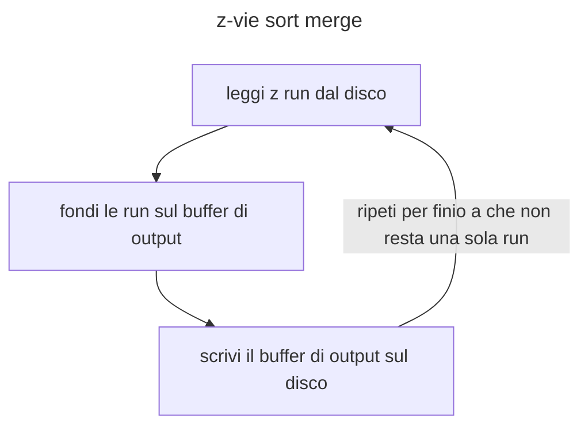

# Ordinare i dati: Sort

L'azione di sort dei dati non e un operatore dell'algebra ma risulta molto utile per risolvere alcune situazioni tra cui query `ORDER BY`, [bulk loading](b+tree.md#Bulk%20loading) degli indici e operatori di `JOIN` e `GROUP BY`.

Gli algoritmi di sort possono essere suddivisi in base alla memoria in cui vengono svolti:

| algoritmi di sort interni                                 | algoritmi di sort esterni                         |
| --------------------------------------------------------- | ------------------------------------------------- |
| eseguiti in memoria centrale, con prestazioni molto buone | eseguiti usando la memoria secondaria di appoggio |

## Merge sort esterno

Il concetto alla base di questo sistema di sorting e caricare i dati in memoria centrale in sequenze (*dette run*), ordinarle con un merge interno e poi eseguire il merge una per volta

>[!NOTE] il primo passo di ordinamento utilizza un sort interno

Nella fase di fusione vengono usati 3 buffer (*uno per l'output*) dove vengono caricati in input le pagine delle run e mergiate nella pagina di output

### Merge sort esterno: performance

dato un numero di pagine in input $P=2^k$ il numero di passi dell'algoritmo di sort merge e $\lceil \log_{2}{P}\rceil +1$ con un costo totale (*in numero di letture scritture*) $2P(\lceil \log_2P\rceil +1)$.
Con $P = 8192$ e tempo di I/O $10ms$ si ha un costo di $38$ minuti
> direi non il massimo...

### Migliorando il sort merge: sort merge a z vie

Un possibile miglioramento consiste nell'utilizzare $Z+1$ buffers (uno sempre per l'output) nella fase di merge, aumentando il fan-in della fase di merge

### Determinare il valore di $Z$

La scelta piu immediata per determinare il valore di $Z$ sarebbe farlo piu grande possibile cosi da massimizzarne il vantaggio, tuttavia questo a 2 limitazioni principali:

- consumo di CPU, in quanto il costo di determinare il maggiore fra $Z$ elementi segue $O(Z)$
- non vi e distinzione tra letture random e sequenziali del disco

Distinguendo tra i due tipi di letture si ha che:

$$
costo \space letture \space sequenziali = (C + X)T_t 
$$
$$
costo \space letture \space random = X(C + 1)T_t 
$$

Di conseguenza si possono organizzare le letture delle pagine in batches detti $Z$-frame da $FS$ pagine ciascuno

## Sorting con [b+tree](b+tree.md)

Nel caso di ordinamento con [b+tree](b+tree.md) e necessario distinguere tra le tipologie di indice

- se l'indice e clustered il costo e dato dal numero di foglie e di pagine del file dati (*costo $L+P$*)
- se l'indice e un-clustered ogni record causa l'accesso al file dati (*costo $L+N$*), se gli attributi interessanti sono contenuti nell'indice si può evitare di accedere al file dati (*costo $L$*)

[PREVIOUS](pages/operatori_relazionali.md) [NEXT](pages/selezione.md)
