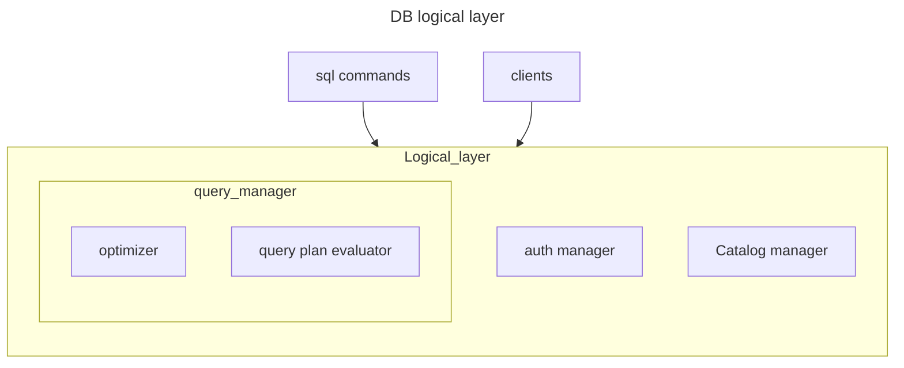
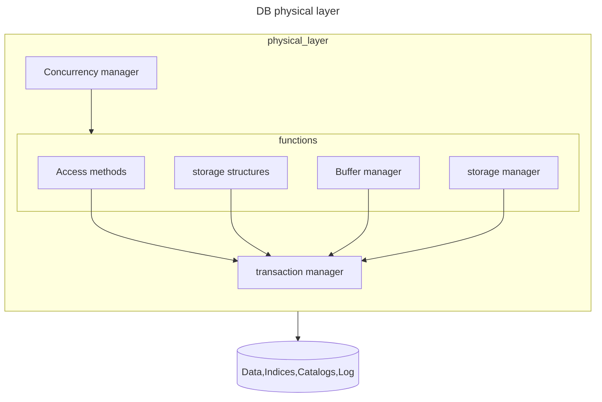

# Come e fatto un database?

Per comprendere come lavora un database e necessario conoscere la sua architettura. Essa può essere scomposta per responsabilità in due componenti principali:

## Struttura logica

componente che si occupa delle funzionalità logiche di un database, gestione utenti informazioni prestazionali e ottimizzazione di query

## Struttura fisica

Componente che si occupa dell' accesso e della gestione della memoria secondaria, del salvataggio e recupero dei dati

Questa suddivisione va a creare due livelli di indipendenza, uno fra gli utilizzatori del database e i modellatori del database mentre l'altro fra i modellatori della struttura logica e i db admin che si occupano del tuning fisico dei parametri di accesso al disco 

## Struttura della memoria e implicazioni per un DBMS

La memoria di un calcolatore e divisa in 3 macro categorie

- primaria (*ram*)
- secondaria (*disco*)
- terziaria (*offline storage come i nastri*)

Data la dimensione un db e contenuto nella memoria secondaria ma per poter lavorare con i dati e necessario trasferirli in memoria centrale, questo comporta un **grosso bottleneck in quanto le velocità di accesso fra memoria centrale e secondaria variano di ordini di grandezza** si ricorda che il tempo di accesso e determinato da:

$$
T_a = latency + \frac{data\space size}{transfer \space speed}
$$

Di conseguenza una grossa parte del lavoro dietro alla modellazione di un database risiede nell'**organizzazione dei dati nel disco in modo da ottimizzarne l'accesso**

 [NEXT](pages/gestione_disco.md)
