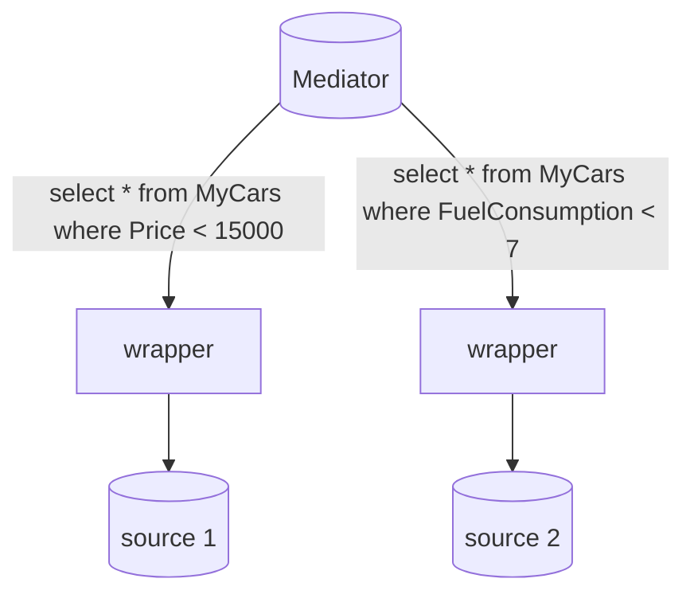

# Top-$k$ join queries

Fino ad ora si sono prese in considerazione query top-$k$ con una sola relazione $R$, tuttavia e necessario considerare anche query della forma come segue:

```sql
SELECT <some attributes>
FROM R1,R2,…,Rn
WHERE <join and local conditions>
ORDER BY S(p1,p2,…pm)
STOP AFTER k
```

In realtà queste **sono una generalizzazione del caso a singola relazione** in cui la Relazione $R$ e spezzata in relazioni virtuali divise

```sql
SELECT *
FROM USEDCARS UC1, USEDCARS UC2, USEDCARS UC3
WHERE UC1.CarID = UC2.CarID
AND UC2.CarID = UC3.CarID
ORDER BY (UC1.Price + UC2.Mileage)/(UC3.Year-1970)
STOP AFTER 2
```
>[!NOTE] in questo caso i join sono tutti 1-1

## Caso di studio per le top-$k$ 1-1 join queries

Il caso di studio che ha portato alla realizzazione delle prima soluzione per questa casistica e stato quello in cui le partizioni di $R$ non sono virtuali (*[database partizionato](progetto_fisico_tuning.md#Partizionamento%20dei%20dati)*) detto anche il **middleware scenario**, definito come segue

- si ha un set di sorgenti di dati
- la query coinvolge due o più di queste sorgenti
- il risultato si ottiene *integrando* in qualche modo i risultati parziali delle singole interrogazioni

per esempio la query

```sql
SELECT * FROM MyCars
WHERE Price < 15000
AND FuelConsumption < 7
```

Viene risolta per mezzo del seguente sistema


>[!TIP] il caso del **middleware scenario** non e diverso dal caso delle top-$k$ join 1-1 query, con la differenza che nel caso delle query gli input sono locali, tuttavia le logiche algoritmiche sono le stesse :)

### input di query top-$k$: assunzioni 

- Si da per certo che le sorgenti dati (*nel caso locale le relazioni*) supportino un accesso ordinato per il parametro di ranking parziale $j$
- inoltre gli oggetti sono identificati  in maniera globale fra le sorgenti dati per mezzo della OID 
- tutte le sorgenti hanno lo stesso set di oggetti

### Scoring functions

Alcune scelte comuni di scoring function sono:

- `SUM(AVG)`
- `WSUM(Weighted sum)`
- `MIN(Minimum)`
- `MAX(Maximum)`

## Algoritmo $B_0$

in caso di funzione di scoring `MAX` la query e risolvibile per mezzo dell'algoritmo $B_0$, l'idea di base e quella di recuperare i primi $k$ migliori risultati parziali da ogni sorgente (ogni accesso e detto **round**) e computare il risultato senza effettuare accessi random

```python
Input: ranked lists Lj (j=1,…,m), integer k  1
Output: the top-k objects according to the MAX scoring function
# B is a main-memory buffer
B = []
for j in range(1,m):
	
	# the set of objects "seen" on Lj
	Obj[j] = {}
	
	for i in range(1,k):
		# get the best k objects from each list
		t = getNextLj();
		Obj[j].append(t.OID)
		if t.OID not in B:
			# adds t to the buffer
			B.append(t)
		else: 
			# join t with the entry in B having the same OID;
# for each object with at least one partial score compute MAX using the available scores
for object in Obj:
	MAX(object) 
return #the k objects with maximum score
```

### Numero minimo di round

E possibile fermare l'algoritmo prima di effettuare $k$ round a patto che sia verificata la seguente condizione

>[!CITE] un algoritmo per top-$k$ 1-1 join queries che usa la funzione `MAX` come scoring function può essere stoppato se $Res[k].score \geq \max_j(p_j)$ 

## Migliorando [B0](#Algoritmo%20$B_0$): MaxOptimal

Il teorema di cui sopra si può applicare seguendo un principio simile a quello visto per [KNNOptimal](top_k_queries.md#Risolvere%20le%20query%20top-$k$%20algoritmo%20KNNOptimal) dove ad ogni step si effettua un accesso ordinato sulla lista dove $p_j$ e massimo (*la più promettente*)

## Perche [B0](#Algoritmo%20$B_0$) non funziona con altre scoring function

$B_0$ non funziona con funzioni diverse dalla funzione `MAX` perche al termine degli accessi sequenziali non vi e nessun limite inferiore al valore della scoring function, di conseguenza un oggetto che non e stato rilevato da un accesso sequenziale **puo essere il match migliore**

>esempio con la funzione `MIN`


## Algoritmo FA

L'algoritmo FA sfrutta la proprietà di monotonicita della funzione di scoring per recuperare i best match, data la definizione di funzione di scoring monotona come segue

$$
x_1 \leq y_1,x_2 \leq y_2,...,x_m \leq y_m \Rightarrow S(x_1,x_2,...,x_m) \leq S(y_1,y_2,...,y_m)
$$

L'algoritmo recupera i primi $k$ score parziali dalle $m$ liste e per ogni oggetto con uno score parziale esegue un accesso random per recuperare gli altri, per ogni oggetto computa $S$ e restituisce i record con lo score massimo

### Problematiche dell'algoritmo FA

L'algoritmo risulta computazionalmente esoso in quanto non viene sfruttata la funzione di scoring per ridurre lo spazio di ricerca, e non vengono anticipati i random access


## Algoritmo TA 

L'algoritmo TA e un miglioramento dell'[Algoritmo FA](#Algoritmo%20FA), basato su threshold, in particolare

- esegue in maniera combinata accessi ordinati e random
- si ferma al raggiungimento di una threshold T che e un upper bound per gli oggetti non ancora visti

```python
# Input: ranked lists Lj (j=1,…,m), integer k  1, monotone scoring function S
# Output: the top-k objects according to S
for i in range(1,k):
	Res[i] := [null,0]
	for j in range(1,m):
		pj := 1
		while Res[k].score < T := S(p1,p2,…,pm):
			for j in range(1,m):
				t := getNextLj()
				o := t.OID
# perform random accesses to retrieve the missing partial scores for o
				if S(o) := S(p1(o),…,pm(o)) > Res[k].score then:
					# {remove the object in Res[k]; insert [o,S(o)] in Res}
# return Res
```

L'algoritmo scandisce le liste fino a che la funzione di costo computata sui valori letti $S(p_1,p_2,...p_m)$ non e inferiore dello score dell'ultimo elemento del risultato (*che e il peggiore risultato corretto*)


### Performance di TA

Per computare correttamente le performance di TA si considerano i costi di comunicazione con il client secondo la seguente funzione di costo:

$$
cost = SA*C_{SA} +RA*C_{RA}
$$

che considera costi di accessi sequenziali e randomici, i parametri $C_{SA},C_{RA}$ rappresentano il costo di singole letture sequenziali e ordinate, questi possono essere molto diversi a seconda degli scenari,

- in caso di risorse web tipicamente si ha che $C_{RA} \gt\gt C_{SA}$
- ma sono possibili risorse in cui non e possibile eseguire letture sequenziali $C_{SA} = \infty$

TA risulta essere **instance optimal** secondo la seguente definizione

>[!CITE] data una classe di algoritmi $A$ e una classe $D$ di input un algoritmo $a \in A$ e instance optimal rispetto a $A$ e $D$ se e vero che per qualunque $B \in A$ e $DB \in D$ si ha $$cost(a,DB) = O(cost(B,DB))$$

dato il modello di costo di cui sopra nel caso in cui $C_{RA} >0$ ovvero il caso reale si ha che il costo di TA che si arresta al passo $X$ e:

$$
cost(TA,DB) = m*X*C_{SA} + (m-1)X*m*C_{RA}
$$

Assumendo il caso peggiore in cui per ogni oggetto visto sia necessario effettuare il massimo numero di accessi random, il ratio di ottimalita risulta essere

$$
m + m(m-1)\frac{C_{RA}}{C_{SA}}
$$
>[!WARNING] Che in caso di costi randomici alti puo diventare proibitivo

## Algoritmo NRA

L'algoritmo NRA e pensato per quando non e possibile effettuare accessi randomici, restituisce comunque le $k$ risposte corrette ma i punteggi di score potrebbero essere errati

L'idea e quella di mantenere per ogni oggetto visto per mezzo della scansione sequenziale un lower e upper bound per la funzione di costo

- $S^-(O)$ computato ponendo a 0 (o al minimo valore possibile) tutti gli score parziali di $O$ non visti per mezzo della scansione sequenziale
- $S^+(O)$ computato ponendo $p_j(O) = p_j$ (*il minimo dei valori visti per quella lista*) tutti gli score parziali di $O$ non visti per mezzo della scansione sequenziale

Gli elementi trovati vengono mantenuti in una lista $B$ ordinati per valori di lowerbound

L'algoritmo termina quando le prime $k$ posizioni di $B$ contengono i valori migliori ovvero

$$
S^+(o^{'}) \leq S^-(o) \forall o^{'} \notin Res, o \in Res
$$

>[!TIP] Ovvero tutti i valori visti non in res hanno un valore massimo di $S$ minore di quelli nel risultato 

### Ottenere le score corrette: NRA*

In caso siano necessari i valori di scoring e sufficiente estendere NRA eseguendo tante scansioni sequenziali fino a che tutti gli oggetti non vengono trovati
>[!WARNING] il costo e al piu uguale a [Algoritmo FA](#Algoritmo%20FA)

## Algoritmo CA

L'idea dietro all'algoritmo CA e quella di ridurre il costo degli accessi randomici eseguendo le letture ogni $\frac{C_{RA}}{C_{SA}}$ rounds, per il resto l'algoritmo si comporta come [NRA](#Algoritmo%20NRA).

## $B_0$, MaxOptimal, FA, TA, NRA, NRA*, CA al confronto

| Algoritmo  | scoring function applicabili | accesso ai dati      | note                                                                                        |
| ---------- | ---------------------------- | -------------------- | ------------------------------------------------------------------------------------------- |
| $B_0$      | MAX                          | ordinato             | instance optimal                                                                            |
| MaxOptimal | MAX                          | ordinato             | instance optimal                                                                            |
| FA         | monotone                     | ordinato e randomico | costo indipendente da $S$                                                                   |
| TA         | monotone                     | ordinato e randomico | instance optimal                                                                            |
| NRA        | monotone                     | ordinato             | instance optimal,wrong scores                                                               |
| NRA*       | monotone                     | ordinato             | instance optimal, exact scores                                                              |
| CA         | monotone                     | ordinato e randomico | instance optimal ratio di ottimalita indipendente da $\frac{C_{RA}}{C_{SA}}$ in alcuni casi |

## Ma in caso di join M-N?

Gli algoritmi visti fino ad ora sono applicabili se i join sono 1-1, nel caso seguente

```sql
SELECT *
FROM RESTAURANTS R, HOTELS H
WHERE R.City = H.City
AND R.Nation = 'Italy'
AND H.Nation = 'Italy'
ORDER BY R.Price + H.Price
STOP AFTER 2
```
> i join non sono più sulle PK delle relazioni

### Caso semplice: Indici !

Se si dispone di indici per ogni attributo di join l'algoritmo risulta simile a quello [TA](#Algoritmo%20TA), sfruttando gli indici per gli accessi randomici

### Caso difficile: non sono concessi accessi randomici

In questo caso e necessario adoperare solo per letture sequenziali (*sulla linea di quanto visto per [NRA*](#Ottenere%20le%20score%20corrette%20NRA*)*) 

## Rank-join

si computa una threshold $T$  definita come 

$$
\max(S(p_1,p_2^{max},...,,p_m^{max}),S(p_1^{max},p_2,...,,p_m^{max}),S(p_1^{max},p_2^{max},...,,p_m))
$$

dove $p_j^{max}$ e definito come il primo valore visto in $L_j$ 


>[!WARNING] per far si che il rank join sia instance optimal e necessario che le relazioni siano al massimo 2 e che ci sia solo uno score parziale per input

[PREVIOUS](pages/top_k_queries.md) [NEXT](pages/rankSQL.md)
