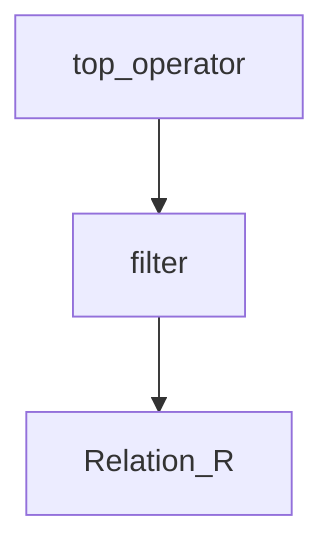

# Top-$k$ queries

l'obbiettivo quando si parla di top-$k$ queries e quello di **fornire i primi $k$ risultati che più si avvicinano alla richiesta della query**


>Gli utilizzi più frequenti di questa tecnologia si hanno dei DB scientifici, motori di ricerca e-commerce sistemi multimediali

## Approccio naive

La soluzione più banale al problema consiste nell'avere una scoring function $S$ che restituisce un punteggio in funzione dei valori della tupla.

```python
to_be_sorted =[]
for tuple in R:
	# compute S for each tuple
	to_be_sorted.append({tuple,S(tuple)})

# sort based on S value and return the first k values
return to_be_sorted.sort().head(k)
```

>[!WARNING] questo approccio e estremamente costoso in quanto prevede il [sorting](sorting.md) di tutte le tuple, ancora peggio se la query prevede uno o più [join](join.md) 

Inoltre si possono verificare casi di near miss o information overload, per esempio le query

```sql
SELECT * FROM  UsedCarsTable
WHERE Vehicle = ‘Audi/A4’ AND Price <= 21000
ORDER BY 0.8*Price + 0.2*Mileage

SELECT * FROM UsedCarsTable
WHERE Vehicle = ‘Audi/A4’
ORDER BY 0.8*Price + 0.2*Mileage
```
 
 soffrono rispettivamente di escludere elementi con prezzo di poco maggiore ma un numero di chilometri estremamente basso (near-miss) e l'altra di dare in output tutti i veicoli di un dato modello (information overload)

## Valutazione di una query top-$k$

Per la valutazione e necessario considerare due aspetti principali:

- numero di relazioni da accedere, valori [aggregati](group_by.md)
- modalità di accesso ai dati (*indici in qualche attributo di ranking*)

prendendo come riferimento la forma più semplice di query top-$k$

```sql
SELECT <some attributes>
FROM R
WHERE <Boolean conditions>
ORDER BY S(<some attributes>) 
STOP AFTER k
```

E necessario estendere l'algebra relazionale con un operatore $\tau_{k,S}$ che restituisca le $k$ tuple migliori secondo la funzione di scoring $S$



## Implementazione dell'operatore Top $\tau_{k,S}$

L'operatore top può essere implementato in due modalità

- **top-scan** la stream di tuple in ingresso e già ordinata e di conseguenza e sufficiente fornire in output le prime $k$ tuple 
> [!TIP] questo operatore puo lavorare in [pipeline](ottimizzazione_interrogazioni.md#Implementare%20l'esecuzione%20in%20pipeline%20Interfaccia%20a%20iteratore)
- **top-sort** la stream non e ordinata e l'operatore la deve ordinare per poi fornire le tuple in output
>[!WARNING] questa implementazione non può lavorare in [pipeline](ottimizzazione_interrogazioni.md#Implementare%20l'esecuzione%20in%20pipeline%20Interfaccia%20a%20iteratore) in quanto necessita di fare [sorting](sorting.md)

### top-sort operator

Per implementare l'operatore top-sort e sufficiente allocare un buffer $B$ che contenga le $k$ tuple, ad ogni tupla letta la si confronta con la $k$-esima già nel buffer e la si scarta se non maggiore
>[!NOTE] se una tupla non e maggiore dell'ultima migliore $k$-esima si presume non fara parte del risultato finale


## Query top-$k$ multidimensionali

Le query top-$k$ coinvolgono spesso più di un attributo nella funzione di scoring $S$

```sql
SELECT *
FROM USEDCARS
WHERE Vehicle = 'Audi/A4'
ORDER BY 0.8*Price + 0.2*Mileage
STOP AFTER 5;
```

In questo caso la situazione e più complessa:

- se non si ha nessun indice non c'e' altra soluzione che applicare l'operatore di top-sort

- Se si può sfruttare un indice sull'attributo di selezione (clausola `WHERE`) allora la situazione migliora ma dipende dalla selettività della selezione
>[!WARNING] senza selezione si sta nella  merda....

**Cosa possiamo fare se avessimo un indice sugli attributi di ranking?, come dovrebbe essere l'indice?**
> analizziamo la geometria :)

Se si plottano le tuple in un grafo basato sugli attributi di scoring si ottiene che le tuple che soddisfano la top-$k$  query si trovano tutte sotto una data linea

> si considera di cercare macchine con i parametri di scoring più bassi possibili


Si può generalizzare a un punto qualunque dello spazio $q$, in questo caso si ottiene che i punti che soddisfano la top-$k$ query sono quelli all'interno di una regione di spazio intorno al punto di query $q$


Di conseguenza il problema delle top-$k$ query **si riduce al problema di trovare i $k$ nearest neighbors  rispetto al query point $q$**

## top-$k$ query come problemi di $k$-NN

Di conseguenza il problema può essere modellato come segue, dato il seguente modello

- uno spazio $D$-dimensionale formato dagli attributi di scoring $A = (A_1,A_2,...,A_D)$
- una relazione $R(A_1,A_2,...,R_1,R_2,....)$
- un query point $q = (q_1,q_2,..,q_D)$
- una funzione $d: A \times A \rightarrow \Re$ che misura la distanza fra due punti di $A$

Il problema diventa:

>[!CITE] dati un punto $q$ una relazione $R$, un intero $k \geq 1$ e una funzione distanza $d$ determinare le $k$ tuple in $R$ che sono le più vicine a $q$ secondo $d$

## Risolvere query top-$k$ con indici

Una possibilità per risolvere le query top-$k$ e quello di usare [b+tree multiattributo](b+tree.md#Ricerche%20multi%20attributo), questa soluzione non e ottimale. e molto meglio usare indici multidimensionali come i [r-tree](r-tree.md)
>[!NOTE] i b+tree multi-attributo mostrano gli stessi problemi che si hanno in caso di [window query](indici_multidimensionali.md#Limiti%20del%20[b+tree](b+tree.md))

###  Determinare se un nodo contiene foglie utili: $d_{MIN}$ limite

Per determinare se un nodo dell'albero deve essere considerato in fase di ricerca si definisce la **distanza del nodo come la distanza della foglia più vicina al punto di ricerca $q$**

$$
d_{MIN}(q,Reg(N)) = inf\{d(q,p) | P \in Reg(N)\}
$$

Di conseguenza si ha che se il nodo $N$ contiene punti interessanti deve essere vero che $d_{MIN}$ deve essere inferiore del raggio di ricerca $r$

$$
Reg(q) \cap Reg(N) \neq \emptyset \Leftrightarrow d_{MIN}(q,Reg(N)) \leq r
$$

### Risolvere le query top-$k$: algoritmo KNNOptimal

Per risolvere le query con il modello sopracitato si introduce l'algoritmo KNNOptimal, l'algoritmo scandisce l'albero considerando i nodi $d_{MIN}(q,Reg(N)) < r$ e memorizza la tupla $t$ con $d(q,t)$ minore

```python
# query point input
q = {} 

# Initialize PQ with [ptr(RN),0];
PQ = []
PQ.append({ptr(RN),0})
rNN = 10000000;
while PQ.len() != 0:
	N = get_distance_and_point(PQ.pop())
	# read page from disk
	Read(N)
	if N is leaf:
		for t in N:
			if d(q,t) < rNN:
			
				# save tuple for result
				result = t
				# update search radius
				rNN = d(q,t)
				# update queue
				update(PQ)
	else:
		for Nc in N:
			if dMIN(q,Reg(Nc)) < rNN:
				ENQUEUE(PQ,[ptr(Nc), dMIN(q,Reg(Nc))])
return result, rNN
```

L'algoritmo KNNOptimal e corretto e I/O-ottimale in quanto accede solo pagine in cui e possibile trovare foglie vicine al risultato

### KNNOptimal e query top-$k$ con filtro

In caso di query della forma

```sql
SELECT *
FROM USEDCARS
WHERE Vehicle = 'Audi/A4'
ORDER BY 0.8*Price + 0.2*Mileage
STOP AFTER 5;
```

non  e detto che l'algoritmo [KNNOptimal](#Risolvere%20le%20query%20top-$k$%20algoritmo%20KNNOptimal) restituisca tuple concordi con il parametro di filtering, per supportare la casistica si utilizza una variante del [KNNOptimal](#Risolvere%20le%20query%20top-$k$%20algoritmo%20KNNOptimal) con supporto al **distance browsing**

nella coda `PQ` si includono anche le tuple e **l'algoritmo termina quando il primo elemento della coda e una tupla**

[PREVIOUS](pages/r-tree.md) [NEXT](pages/top_k_join_queries.md)
