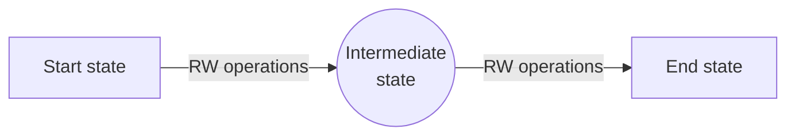
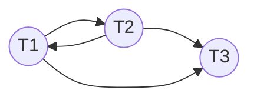
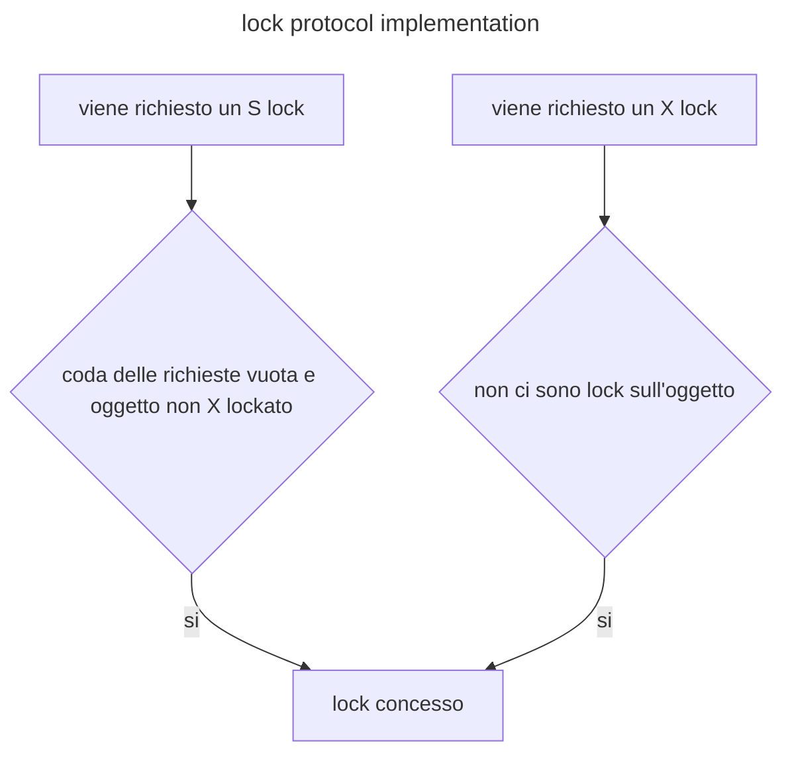

# transazioni

Le transazioni sono operazioni logiche che portano il db da uno stato consistente ad un altro rispettando le proprieta dette **ACID**

- **Atomicity** la transazione non può essere interrotta da altra operazioni
- **Consistency** il db alla fine della transazione deve trovarsi in uno stato consistente (*i vincoli definiti sul db non devono essere violati*)
- **Isolation** l'esecuzione di una transazione non deve interferire con l'esecuzione di un altra
- **Durability** le modifiche apportate da una transazione devono essere persistenti

Garantire tali proprietà e compito dei  [componenti del DBMS](struttura_database.md#STRUTTURA%20FISICA)

Una transazione e composta da una moltitudine di operazioni che portano la base dati in stati intermedi

Una transazione può completarsi con successo (`commit`) oppure fallire, in questo caso il db viene riportato allo stato precedente alla transazione (`rollback`)

e possibile definire dei savepoint che consentono di eseguire rollback parziali a stati intermedi della transazione

## Esecuzione delle transazioni

Le transazioni possono essere eseguite in maniera **seriale** o **concorrente**, la prima garantisce la consistenza dei dati a scapito del throughput (*numero di transazioni al secondo*) mentre la seconda migliora le performance ma può portare a dati inconsistenti

## Problemi dell'esecuzione concorrente

L'esecuzione concorrente delle transazioni può portare a 4 tipologie di inconsistenze nella base dati

- **lost update** due azioni di modifica di un record in cui una sovrascrive l'altra
- **Dirty read** lettura di dati non ancora committati
- **Unrepeatable Read** intervallare letture a scritture
- **Phantom Row** dati inseriti non appaiono in fase di lettura della query

## Determinare l'ordine nelle transazioni: Schedule

Il DBMS può organizzare le operazioni di due transazioni in molteplici ordini, la struttura che mostra tale ordinamento si chiama **schedule**

### Proprietà di schedule

Esistono diverse proprietà di schedule:

| **Property**     | Description                                                                                                                     |
| ---------------- | ------------------------------------------------------------------------------------------------------------------------------- |
| **Serial**       | le transazioni sono eseguite in maniera sequenziale                                                                             |
| **Serializable** | uno schedule che conivolge solo transizioni committate i cui effetti sul db sono riconducibili a quello di uno schedule Seriale |
| **Recoverable**  | Se la transazione $T1$ legge una modifica di una transazione $T2$ $T2$ committa per prima                                       |
| **Cascadeless**  | Una transazione può leggere modifiche solo di transizioni committate                                                            |
| **Strict**       | Una transazione non tocca valori modificati da un altra transazione attiva                                                      |

## Gestire gli accessi concorrenti: locks

Uno dei sistemi più comuni per gestire gli accessi concorrenti e quello di utilizzare dei **lock**, una transazione prima di operare su un dato deve acquisire un lock che ne garantisce l'utilizzo esclusivo, i lock possono essere di due tipi:

- **shared** lock per l'accesso in lettura
- **exclusive**  lock per l'accesso in scrittura

il [transaction manager](struttura_database.md#Struttura%20fisica) concede la il lock alla transazione secondo il seguente schema

|                      | lock S concesso | lock X concesso |
| -------------------- | --------------- | --------------- |
| **richiesta lock S** | YES             | NO              |
| **richiesta lock X** | NO              | NO              |

>[!TIP] in breve non si puo accedere in scrittura se qualcuno sta usando la risorsa, mentre si puo accedere in lettura se tutti stanno leggendo

>[!NOTE] i lock funzionano solo se le operazioni di **acquisizione e rilascio sono atomiche**
## Gestire i lock: Strict 2-phase lock protocol

L'isolamento di una transazione e garantito se essa acquisisce tutti i lock necessari ad operare subito e li rilascia alla fine (*sia in caso di commit che di rollback*)

Tuttavia questo può portare a situazioni di **deadlock** che possono essere risolte abortendo una transazione

## Modellare i conflitti: Grafo di serializzabilita

Per poter comprendere se un insieme di transazioni genera un deadlock si introduce il grafo di serializzabilita, ogni transazione viene modellata come un nodo del grafo e un arco tra due transazioni $T_i$ e $T_j$ simboleggia un conflitto tra le azioni delle due transazioni. un **deadlock si presenta se il grafo non e aciclico**

## Migliorando [S2PL](#Gestire%20i%20lock%20Strict%202-phase%20lock%20protocol): 2-phase lock protocol

In questa variante una transazione non può richiedere altri lock nel momento in cui libera ne libera uno, ne consegue che la vita di una transazione si divide in due fasi:

- nella prima fase la transazione accresce il numero di lock acquisiti
- nella seconda fase la transazione rilascia i lock acquisiti

>[!WARNING] gli [schedule](#Determinare%20l'ordine%20nelle%20transazioni%20Schedule) generati dal protocollo 2PL non sono [strict](#Proprietà%20di%20schedule)

## Prevenire il problema della phantom row

Tra i [problemi dell'esecuzione concorrente](#Problemi%20dell'esecuzione%20concorrente) quello della phantom row e il più complesso da gestire, alcune soluzioni prevedono:

- richiedere il lock **sull'indice di tutti i record che soddisfano un dato predicato**
- in caso di [indici](indici.md) si richiede il lock a livello di foglia che soddisfa il predicato

## Lock management: implementazione

Per poter implementare la gestione dei lock il [lock manager](struttura_database.md#Struttura%20fisica)  mantiene in memoria:

- una **tabella delle transazioni attive** con una lista di lock per ogni transazione
- una **tabella dei lock** dove per ogni oggetto viene segnato il tipo di lock, il numero della transazione che lo detiene e una lista di richieste per quel dato lock

Al termine di una transazione tutti i suoi lock sono rilasciati (*sia in caso di commit che di abort*) 

## Deadlock management: implementazione

Ci sono due tipologie principali di strategie:

| Prevenzione della deadlock | Individuazione della deadlock |
| -------------------------- | ----------------------------- |
| strategia wait-die         | waits-for graph               |
| strategia wait-bleed       |                               |

> [!NOTE] in ogni caso una transazione dovra essere abortita

### Prevenzione della deadlock

Si assegna una priorità alle transazioni, se $T_1$ richiede un lock su $O$  e $T_2$ ha un lock su $O$ che crea conflitto:

- **wait-die** se $T_1 \gt T_2$ allora $T_1$ attende $T_2$ altrimenti $T_1$ viene abortita
- **wound-wait** se $T_1 \gt T_2$ allora $T_1$ attende $T_2$ altrimenti $T_1$ viene abortita

### Individuazione della deadlock

In questa modalità vengono utilizzati i [grafi di serializzabilita](#Modellare%20i%20conflitti%20Grafo%20di%20serializzabilita) periodicamente per determinare se le transazioni attive al momento generano situazioni di deadlock. La selezione della transazione da abortire può seguire diversi parametri:

- lavoro svolto
- lavoro rimasto da svolgere per la transazione
- numero di volte in cui una transazione e stata abortita
- numero di lock detenuto

## Livelli di isolamento

I DBMS offrono la possibilità di determinare un livello di isolamento, diversi livelli di isolamento garantiscono prestazioni diverse e prevengono diversi [errori](#Problemi%20dell'esecuzione%20concorrente)

| livello di isolamento | Phantom row | Unrepeatable read | Dirty read | Lost Update |
| --------------------- | :---------: | :---------------: | :--------: | :---------: |
| Serializable          |     NO      |        NO         |     NO     |     NO      |
| Repeatable read       |     YES     |        NO         |     NO     |     NO      |
| Read committed        |     YES     |        YES        |     NO     |     NO      |
| Uncommitted read      |     YES     |        YES        |    YES     |   NO     |

## Gestire la concorrenza con granularita

Un DBMS dovrebbe essere in grado di gestire la concorrenza con diversi livelli di granularita, estendendo i meccanismi anche agli indici.

[PREVIOUS](pages/indici_hash.md) [NEXT](pages/durability_control.md)
